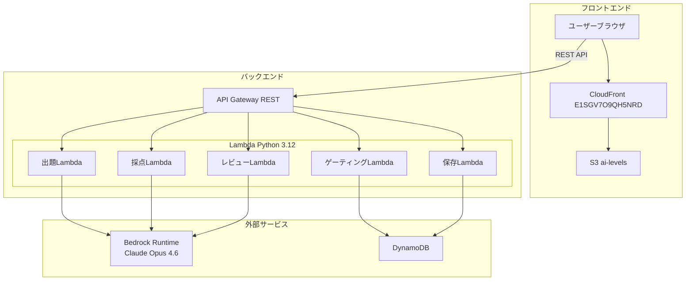
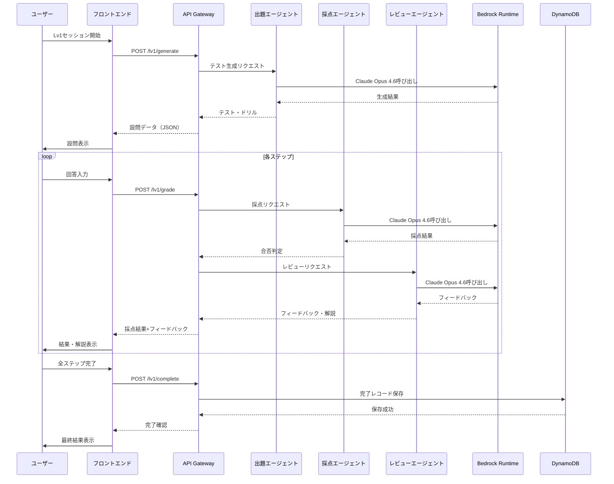

# デザインドキュメント: AI Levels Lv1 MVP

## 概要

AI Levels Lv1 MVPは、3つのAIエージェント（出題・採点・レビュー）が連動するカリキュラム実行システムである。フロントエンドはS3+CloudFrontの静的サイト、バックエンドはAPI Gateway+Lambda（Python 3.12）のサーバーレス構成で、AWS Bedrock上のClaude Opus 4.6を利用する。ログイン不要で、全ステップ完了時のみDynamoDBにデータを永続化する。将来のLv2〜Lv4拡張を見据えたゲーティング構造を初期から備える。

## アーキテクチャ

### システム構成図



### パイプラインフロー



## コンポーネントとインターフェース

### APIエンドポイント

| メソッド | パス | 説明 | Lambda |
|---------|------|------|--------|
| POST | /lv1/generate | テスト・ドリル生成 | generate_handler |
| POST | /lv1/grade | 回答採点+レビュー | grade_handler |
| POST | /lv1/complete | 完了レコード保存 | complete_handler |
| GET | /levels/status | レベル合格状態取得 | gate_handler |

### 出題エージェント（Test_Generator）

```python
# generate_handler.py
def handler(event, context):
    """
    POST /lv1/generate
    リクエスト: { "session_id": str }
    レスポンス: {
        "session_id": str,
        "questions": [
            {
                "step": int,
                "type": str,          # "multiple_choice" | "free_text" | "scenario"
                "prompt": str,
                "options": list[str] | None,
                "context": str | None
            }
        ]
    }
    """
```

プロンプト設計:
- カリキュラム「分業設計×依頼設計×品質担保×2ケース再現」の内容をシステムプロンプトに埋め込む
- 毎回異なる問題を生成するため、ランダム性を指示するプロンプトを含める
- JSON形式で出力するよう指示する

### 採点エージェント（Grader）

```python
# grade_handler.py
def handler(event, context):
    """
    POST /lv1/grade
    リクエスト: {
        "session_id": str,
        "step": int,
        "question": { ... },
        "answer": str
    }
    レスポンス: {
        "session_id": str,
        "step": int,
        "passed": bool,
        "score": int,          # 0-100
        "feedback": str,       # Reviewerからのフィードバック
        "explanation": str     # Reviewerからの解説
    }
    """
```

採点→レビューの連動:
- grade_handlerの内部でGraderを呼び出し、その結果をReviewerに渡す
- 1つのAPIコールで採点+レビューを完結させる

### レビューエージェント（Reviewer）

```python
# reviewer.py
def generate_feedback(question, answer, grade_result):
    """
    採点結果をもとにフィードバック・解説を生成する。
    grade_handlerから内部的に呼び出される。
    戻り値: { "feedback": str, "explanation": str }
    """
```

### 完了保存ハンドラ

```python
# complete_handler.py
def handler(event, context):
    """
    POST /lv1/complete
    リクエスト: {
        "session_id": str,
        "questions": [...],
        "answers": [...],
        "grades": [...],
        "final_passed": bool
    }
    レスポンス: { "saved": bool, "record_id": str }
    """
```

### ゲーティングハンドラ

```python
# gate_handler.py
def handler(event, context):
    """
    GET /levels/status?session_id={session_id}
    レスポンス: {
        "levels": {
            "lv1": { "unlocked": true, "passed": bool },
            "lv2": { "unlocked": bool, "passed": false },
            "lv3": { "unlocked": false, "passed": false },
            "lv4": { "unlocked": false, "passed": false }
        }
    }
    """
```

### フロントエンド構成

```
frontend/
├── index.html          # エントリーポイント（レベル選択画面）
├── lv1.html            # Lv1カリキュラム実行画面
├── css/
│   └── style.css       # スタイルシート
└── js/
    ├── app.js          # メインアプリケーションロジック
    ├── api.js          # APIクライアント
    └── gate.js         # ゲーティングロジック
```

- バニラHTML/CSS/JSで構成（フレームワーク不使用）
- セッション途中のデータはブラウザのsessionStorageで管理
- 全ステップ完了時にのみAPIを通じてDynamoDBに保存

### Bedrock呼び出し共通モジュール

```python
# bedrock_client.py
import boto3
import json

def invoke_claude(system_prompt: str, user_prompt: str) -> dict:
    """
    Bedrock RuntimeでClaude Opus 4.6を呼び出す共通関数。
    リージョン: ap-northeast-1
    モデルID: global.anthropic.claude-opus-4-6-v1
    """
    client = boto3.client("bedrock-runtime", region_name="ap-northeast-1")
    response = client.invoke_model(
        modelId="global.anthropic.claude-opus-4-6-v1",
        contentType="application/json",
        accept="application/json",
        body=json.dumps({
            "anthropic_version": "bedrock-2023-05-31",
            "max_tokens": 4096,
            "system": system_prompt,
            "messages": [{"role": "user", "content": user_prompt}]
        })
    )
    result = json.loads(response["body"].read())
    return result
```

## データモデル

### DynamoDBテーブル設計

#### テーブル: ai-levels-results

| 属性 | 型 | 説明 |
|------|-----|------|
| PK | String | `SESSION#{session_id}` |
| SK | String | `RESULT#lv1` |
| session_id | String | セッション識別子（UUID） |
| level | String | レベル（"lv1"） |
| questions | List | 全設問データ |
| answers | List | 全回答データ |
| grades | List | 全採点結果 |
| final_passed | Boolean | 最終合否 |
| total_score | Number | 合計スコア |
| completed_at | String | 完了タイムスタンプ（ISO 8601） |
| ttl | Number | TTL（オプション、将来用） |

#### テーブル: ai-levels-progress

| 属性 | 型 | 説明 |
|------|-----|------|
| PK | String | `SESSION#{session_id}` |
| SK | String | `PROGRESS` |
| session_id | String | セッション識別子（UUID） |
| lv1_passed | Boolean | Lv1合格フラグ |
| lv2_passed | Boolean | Lv2合格フラグ（将来用） |
| lv3_passed | Boolean | Lv3合格フラグ（将来用） |
| lv4_passed | Boolean | Lv4合格フラグ（将来用） |
| updated_at | String | 更新タイムスタンプ（ISO 8601） |

### セッションデータ（フロントエンド sessionStorage）

```json
{
  "session_id": "uuid-v4",
  "current_step": 0,
  "questions": [],
  "answers": [],
  "grades": [],
  "started_at": "ISO 8601"
}
```

### Serverless Framework設定

```yaml
# serverless.yml
service: ai-levels-backend
frameworkVersion: '3'

provider:
  name: aws
  runtime: python3.12
  region: ap-northeast-1
  environment:
    RESULTS_TABLE: ai-levels-results
    PROGRESS_TABLE: ai-levels-progress
    BEDROCK_MODEL_ID: global.anthropic.claude-opus-4-6-v1
  iam:
    role:
      statements:
        - Effect: Allow
          Action:
            - dynamodb:PutItem
            - dynamodb:GetItem
            - dynamodb:Query
          Resource:
            - !GetAtt ResultsTable.Arn
            - !GetAtt ProgressTable.Arn
        - Effect: Allow
          Action:
            - bedrock:InvokeModel
          Resource: "*"

functions:
  generate:
    handler: handlers/generate_handler.handler
    events:
      - http:
          path: lv1/generate
          method: post
          cors: true
  grade:
    handler: handlers/grade_handler.handler
    events:
      - http:
          path: lv1/grade
          method: post
          cors: true
  complete:
    handler: handlers/complete_handler.handler
    events:
      - http:
          path: lv1/complete
          method: post
          cors: true
  gate:
    handler: handlers/gate_handler.handler
    events:
      - http:
          path: levels/status
          method: get
          cors: true

resources:
  Resources:
    ResultsTable:
      Type: AWS::DynamoDB::Table
      Properties:
        TableName: ai-levels-results
        BillingMode: PAY_PER_REQUEST
        AttributeDefinitions:
          - AttributeName: PK
            AttributeType: S
          - AttributeName: SK
            AttributeType: S
        KeySchema:
          - AttributeName: PK
            KeyType: HASH
          - AttributeName: SK
            KeyType: RANGE
    ProgressTable:
      Type: AWS::DynamoDB::Table
      Properties:
        TableName: ai-levels-progress
        BillingMode: PAY_PER_REQUEST
        AttributeDefinitions:
          - AttributeName: PK
            AttributeType: S
          - AttributeName: SK
            AttributeType: S
        KeySchema:
          - AttributeName: PK
            KeyType: HASH
          - AttributeName: SK
            KeyType: RANGE
```

### GitHub Actions設定

```yaml
# .github/workflows/deploy.yml
name: Deploy
on:
  push:
    branches: [main]

jobs:
  deploy-backend:
    runs-on: ubuntu-latest
    steps:
      - uses: actions/checkout@v4
      - uses: actions/setup-python@v5
        with:
          python-version: '3.12'
      - uses: actions/setup-node@v4
        with:
          node-version: '20'
      - run: npm install -g serverless@3
      - run: pip install -r requirements.txt
      - run: serverless deploy --stage prod
        env:
          SERVERLESS_ACCESS_KEY: ${{ secrets.SERVERLESS_ACCESS_KEY }}
          AWS_ACCESS_KEY_ID: ${{ secrets.AWS_ACCESS_KEY_ID }}
          AWS_SECRET_ACCESS_KEY: ${{ secrets.AWS_SECRET_ACCESS_KEY }}

  deploy-frontend:
    runs-on: ubuntu-latest
    steps:
      - uses: actions/checkout@v4
      - run: aws s3 sync frontend/ s3://ai-levels --delete
      - run: aws cloudfront create-invalidation --distribution-id E1SGV7O9QH5NRD --paths "/*"
        env:
          AWS_ACCESS_KEY_ID: ${{ secrets.AWS_ACCESS_KEY_ID }}
          AWS_SECRET_ACCESS_KEY: ${{ secrets.AWS_SECRET_ACCESS_KEY }}
          AWS_DEFAULT_REGION: ap-northeast-1
```


## 正当性プロパティ

*プロパティとは、システムの全ての有効な実行において成り立つべき特性や振る舞いのことである。人間が読める仕様と機械的に検証可能な正当性保証の橋渡しとなる形式的な記述である。*

### Property 1: 生成結果の構造的正当性

*任意の*セッションIDに対して、Test_Generatorが返す生成結果は、questions配列を含み、各要素がstep（1からの連番）、type（"multiple_choice" | "free_text" | "scenario"のいずれか）、prompt（空でない文字列）を持つ正しいJSON構造であること。

**Validates: Requirements 1.1, 1.4**

### Property 2: 生成結果のランダム性

*任意の*セッションIDに対して、Test_Generatorを2回呼び出した場合、生成されるテスト・ドリルの内容（promptフィールド）が完全一致しないこと。

**Validates: Requirements 1.2**

### Property 3: 採点結果の構造的正当性

*任意の*設問と回答の組み合わせに対して、Graderが返す採点結果は、passed（bool型）とscore（0〜100の整数）を含む正しい構造であること。

**Validates: Requirements 2.1, 2.3**

### Property 4: レビュー結果の構造的正当性

*任意の*採点結果に対して、Reviewerが返すレビュー結果は、feedback（空でない文字列）とexplanation（空でない文字列）の両フィールドを含むこと。

**Validates: Requirements 3.1**

### Property 5: 完了レコードの完全性

*任意の*完了データに対して、DynamoDBに保存されるレコードは、session_id、completed_at（ISO 8601タイムスタンプ）、questions、answers、grades、final_passedの全フィールドを含むこと。

**Validates: Requirements 5.1, 5.3**

### Property 6: 途中セッションでのDB非書き込み

*任意の*generate_handlerまたはgrade_handlerへのリクエストに対して、DynamoDBへの書き込み操作が発生しないこと。

**Validates: Requirements 5.2**

### Property 7: ゲーティングロジックの正当性

*任意の*セッション状態に対して、Lv1が合格していない場合、レベル状態APIはLv2以降のunlockedをfalseで返すこと。Lv1が合格している場合のみLv2のunlockedがtrueになること。

**Validates: Requirements 6.3**

### Property 8: 認証なしアクセス

*任意の*Lv1関連エンドポイントへのリクエストに対して、Authorizationヘッダーが存在しなくてもリクエストが正常に処理されること。

**Validates: Requirements 7.3**

## エラーハンドリング

### Bedrock Runtime呼び出しエラー

| エラー種別 | 対応 |
|-----------|------|
| ThrottlingException | 指数バックオフで最大3回リトライ |
| ModelTimeoutException | タイムアウトエラーをユーザーに通知、リトライ促進 |
| ValidationException | リクエストパラメータを検証しエラーログ記録 |
| ServiceUnavailableException | サービス一時停止メッセージをユーザーに表示 |

### DynamoDB書き込みエラー

| エラー種別 | 対応 |
|-----------|------|
| ConditionalCheckFailedException | 重複保存を防止、既存レコードを返却 |
| ProvisionedThroughputExceededException | 指数バックオフでリトライ |
| その他の書き込みエラー | エラーログ記録、ユーザーにリトライ可能な旨を通知（要件5.4） |

### APIリクエストバリデーション

- 全エンドポイントでリクエストボディのJSON構造を検証
- 必須フィールドの欠落時は400 Bad Requestを返却
- session_idの形式（UUID v4）を検証

### フロントエンドエラーハンドリング

- API呼び出し失敗時はユーザーにリトライボタンを表示
- ネットワークエラー時は接続状態を確認するメッセージを表示
- sessionStorageの容量超過時は古いデータをクリアして続行

## テスト戦略

### テストフレームワーク

- **バックエンド**: pytest + pytest-mock（ユニットテスト）、hypothesis（プロパティベーステスト）
- **フロントエンド**: 手動テスト（MVP段階）

### プロパティベーステスト

プロパティベーステストライブラリとして**hypothesis**（Python）を使用する。

各プロパティテストは最低100回のイテレーションで実行する。各テストにはデザインドキュメントのプロパティ番号を参照するコメントタグを付与する。

タグ形式: **Feature: ai-levels-lv1-mvp, Property {number}: {property_text}**

各正当性プロパティは1つのプロパティベーステストで実装する。

### ユニットテスト

ユニットテストはプロパティベーステストを補完し、以下に焦点を当てる:
- 具体的な入出力例の検証
- エッジケース（空文字列、境界値、不正なJSON等）
- エラーハンドリングの動作確認
- Bedrock呼び出しのモック検証（正しいリージョン・モデルID）
- パイプライン順序の検証（Test_Generator → Grader → Reviewer）

### テスト構成

```
tests/
├── unit/
│   ├── test_generate_handler.py
│   ├── test_grade_handler.py
│   ├── test_complete_handler.py
│   ├── test_gate_handler.py
│   ├── test_bedrock_client.py
│   └── test_reviewer.py
└── property/
    ├── test_generate_properties.py
    ├── test_grade_properties.py
    ├── test_review_properties.py
    ├── test_complete_properties.py
    ├── test_gate_properties.py
    └── test_auth_properties.py
```
