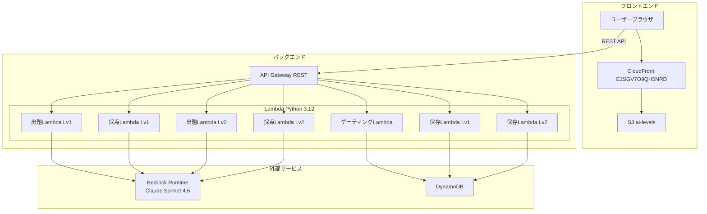
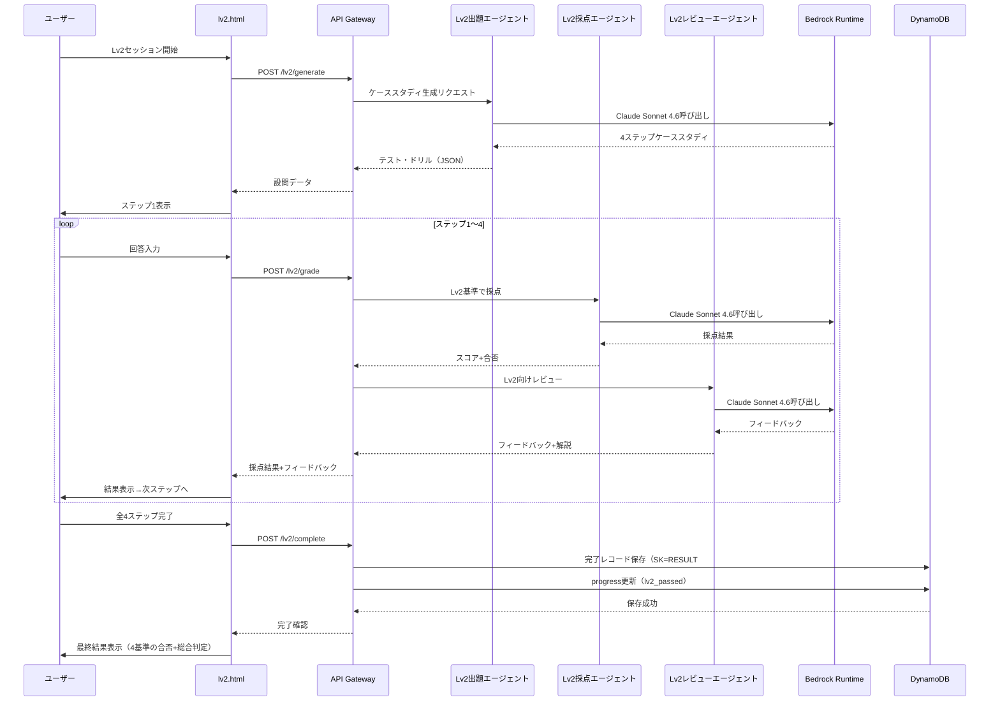

# デザインドキュメント: AI Levels Lv2 カリキュラム

## 概要

AI Levels Lv2は、Lv1合格者を対象とした実践的カリキュラムである。テーマは「業務プロセス設計×AI実行指示×成果物検証×改善サイクル」で、4ステップのケーススタディ形式テストを通じて受講者の実務応用力を測定する。

既存のLv1アーキテクチャ（Lambda + Bedrock + DynamoDB + 3エージェントパイプライン）を最大限再利用し、Lv2固有のシステムプロンプト・テスト設計・フロントエンドを追加する。共通モジュール（`bedrock_client.py`）はそのまま利用し、Lv2用ハンドラは既存Lv1ハンドラと同一パターンで新規作成する。

### Lv1との主な差分

| 項目 | Lv1 | Lv2 |
|------|-----|-----|
| テーマ | 分業設計×依頼設計×品質担保×2ケース再現 | 業務プロセス設計×AI実行指示×成果物検証×改善サイクル |
| 設問数 | 3問 | 4問（ケーススタディ4ステップ） |
| 設問形式 | 独立した設問 | 同一業務シナリオに基づく連続ステップ |
| 採点基準 | 汎用（理解度・具体性） | Lv2固有（プロセス具体性・指示構造化度・検証的確さ・改善実現可能性） |
| 合格基準 | 各設問60点以上 | 各基準60点以上（4基準すべて） |
| SK | RESULT#lv1 | RESULT#lv2 |
| エンドポイント | /lv1/* | /lv2/* |

## アーキテクチャ

### システム構成図



### Lv2パイプラインフロー



## コンポーネントとインターフェース

### APIエンドポイント（Lv2追加分）

| メソッド | パス | 説明 | Lambda |
|---------|------|------|--------|
| POST | /lv2/generate | Lv2ケーススタディ生成 | lv2_generate_handler |
| POST | /lv2/grade | Lv2回答採点+レビュー | lv2_grade_handler |
| POST | /lv2/complete | Lv2完了レコード保存 | lv2_complete_handler |
| GET | /levels/status | レベル合格状態取得（Lv2対応拡張） | gate_handler（既存拡張） |

### Lv2出題エージェント（Test_Generator）

```python
# backend/handlers/lv2_generate_handler.py
def handler(event, context):
    """
    POST /lv2/generate
    リクエスト: { "session_id": str }
    レスポンス: {
        "session_id": str,
        "questions": [
            {
                "step": 1,
                "type": "scenario",
                "prompt": "業務プロセス設計の設問文",
                "options": null,
                "context": "ケーススタディの業務シナリオ"
            },
            {
                "step": 2,
                "type": "free_text",
                "prompt": "AI実行指示の設問文",
                "options": null,
                "context": "ステップ1の設計を前提とした指示作成の文脈"
            },
            {
                "step": 3,
                "type": "scenario",
                "prompt": "成果物検証の設問文",
                "options": null,
                "context": "AIが生成した成果物サンプル"
            },
            {
                "step": 4,
                "type": "free_text",
                "prompt": "改善サイクルの設問文",
                "options": null,
                "context": "一連のプロセス振り返りの文脈"
            }
        ]
    }
    """
```

Lv2システムプロンプト設計方針:
- カリキュラム「業務プロセス設計×AI実行指示×成果物検証×改善サイクル」をシステムプロンプトに埋め込む
- コンサルティング業務で実際に発生しうるシナリオを生成するよう指示
- 4問すべてが同一業務シナリオに基づく一貫したケーススタディとなるよう指示
- ステップ間の依存関係（ステップ2はステップ1の設計を前提とする等）を明示
- 毎回異なるシナリオを生成するためランダム性を指示

```python
LV2_GENERATE_SYSTEM_PROMPT = """AIカリキュラム「業務プロセス設計×AI実行指示×成果物検証×改善サイクル」の出題エージェント。
コンサルティング業務で実際に発生しうる業務シナリオに基づく4ステップのケーススタディを生成せよ。
4問すべてが同一の業務シナリオに基づき、一貫性のあるケーススタディとすること。
毎回異なる業務シナリオを使うこと。

ステップ構成:
- ステップ1（業務プロセス設計）: scenario形式 — 業務シナリオを提示し、AI活用フローの設計を求める
- ステップ2（AI実行指示）: free_text形式 — ステップ1で設計したフローの一部について、AIへの具体的な指示文を作成させる
- ステップ3（成果物検証）: scenario形式 — AIが生成した成果物サンプルを提示し、品質評価と改善指示を求める
- ステップ4（改善サイクル）: free_text形式 — 一連のプロセスを振り返り、改善提案を求める

出力JSON形式（これ以外のテキスト禁止）:
{"questions":[{"step":1,"type":"scenario","prompt":"設問文","options":null,"context":"業務シナリオ説明"},{"step":2,"type":"free_text","prompt":"設問文","options":null,"context":"文脈説明"},{"step":3,"type":"scenario","prompt":"設問文","options":null,"context":"成果物サンプル"},{"step":4,"type":"free_text","prompt":"設問文","options":null,"context":"振り返り文脈"}]}

typeは "scenario" または "free_text" のみ。stepは1〜4の連番。contextは必ず含めること。"""
```

### Lv2採点エージェント（Grader）

```python
# backend/handlers/lv2_grade_handler.py
def handler(event, context):
    """
    POST /lv2/grade
    リクエスト: {
        "session_id": str,
        "step": int,          # 1〜4
        "question": { ... },
        "answer": str
    }
    レスポンス: {
        "session_id": str,
        "step": int,
        "passed": bool,       # score >= 60
        "score": int,         # 0〜100
        "feedback": str,
        "explanation": str
    }
    """
```

Lv2採点基準（ステップごとに異なる基準を適用）:

```python
LV2_GRADE_SYSTEM_PROMPT = """あなたはAIカリキュラム「業務プロセス設計×AI実行指示×成果物検証×改善サイクル」の採点エージェントです。

ステップごとの採点基準:
- ステップ1（業務プロセス設計）: AIと人間の役割分担が明確か、フローが具体的で実行可能か、業務シナリオの制約を考慮しているか
- ステップ2（AI実行指示）: 目的・制約・出力形式が構造化されているか、業務文脈に適した指示か、AIの特性を活かした指示か
- ステップ3（成果物検証）: 業務要件との適合性を評価できているか、正確性の問題を指摘できているか、改善指示が具体的か
- ステップ4（改善サイクル）: 改善点の根拠が明確か、次回に活かせる具体的な提案か、プロセス全体を俯瞰できているか

出力は必ず以下のJSON形式で返してください。それ以外のテキストは含めないでください:
{
  "passed": true または false,
  "score": 0〜100の整数
}

60点以上を合格とする。"""
```

### Lv2レビューエージェント（Reviewer）

```python
# backend/lib/lv2_reviewer.py
LV2_REVIEW_SYSTEM_PROMPT = """あなたはAIカリキュラム「業務プロセス設計×AI実行指示×成果物検証×改善サイクル」のレビューエージェントです。

採点結果をもとに、学習者に対するフィードバックと解説を生成してください。

フィードバックでは:
- 回答の良かった点と改善点を具体的に指摘する
- 実務での具体的な改善アクションを含める
- Lv2の学習目標（業務プロセス設計・AI実行指示・成果物検証・改善サイクル）に沿った助言を行う

解説では:
- 正解の考え方や背景知識を説明する
- コンサルティング実務での応用例を含める

出力は必ず以下のJSON形式で返してください。それ以外のテキストは含めないでください:
{
  "feedback": "フィードバック文",
  "explanation": "解説文"
}"""

def generate_lv2_feedback(question: dict, answer: str, grade_result: dict) -> dict:
    """Lv2用フィードバック・解説を生成する。Lv1のreviewer.pyと同一パターン。"""
```

### Lv2完了保存ハンドラ

```python
# backend/handlers/lv2_complete_handler.py
def handler(event, context):
    """
    POST /lv2/complete
    リクエスト: {
        "session_id": str,
        "questions": [...],
        "answers": [...],
        "grades": [...],
        "final_passed": bool
    }
    レスポンス: { "saved": bool, "record_id": str }
    """
```

Lv1の`complete_handler.py`と同一パターンだが以下が異なる:
- SK: `RESULT#lv2`（Lv1は`RESULT#lv1`）
- level: `"lv2"`
- `_update_progress`で`lv2_passed`フラグを更新（既存のlv1_passedは保持）

### ゲーティングハンドラ拡張

既存の`gate_handler.py`の`_build_levels`関数を拡張し、`lv2_passed`も参照する:

```python
def _build_levels(lv1_passed: bool, lv2_passed: bool) -> dict:
    """Build the levels status dict based on progress."""
    return {
        "lv1": {"unlocked": True, "passed": lv1_passed},
        "lv2": {"unlocked": lv1_passed, "passed": lv2_passed},
        "lv3": {"unlocked": lv2_passed, "passed": False},
        "lv4": {"unlocked": False, "passed": False},
    }
```

### フロントエンド構成（Lv2追加分）

```
frontend/
├── index.html          # Lv2カード更新（リンク追加）
├── lv2.html            # Lv2ケーススタディ実行画面（新規）
├── css/
│   └── style.css       # Lv2用スタイル追加
└── js/
    ├── app.js          # Lv1用（変更なし）
    ├── lv2-app.js      # Lv2用アプリケーションロジック（新規）
    ├── api.js          # Lv2エンドポイント追加
    ├── gate.js         # ゲーティングロジック（変更なし）
    └── config.js       # API Base URL（変更なし）
```

#### lv2.htmlの設計

- Lv1の`lv1.html`と同一レイアウト構造を踏襲
- ケーススタディ形式に適したUI:
  - シナリオ表示エリアの拡大（contextフィールドを目立つカードで表示）
  - 長文回答用テキストエリア（rows拡大、文字数カウンター付き）
  - ステップ間の進行状況を4ステップで表示
- ページ読み込み時にLv1合格状態を検証し、未合格の場合は`index.html`にリダイレクト

#### api.jsの拡張

```javascript
// Lv2用エンドポイント追加
function lv2Generate(sessionId) {
  return request("/lv2/generate", {
    method: "POST",
    body: JSON.stringify({ session_id: sessionId }),
  });
}

function lv2Grade(sessionId, step, question, answer) {
  return request("/lv2/grade", {
    method: "POST",
    body: JSON.stringify({ session_id: sessionId, step, question, answer }),
  });
}

function lv2Complete(payload) {
  return request("/lv2/complete", {
    method: "POST",
    body: JSON.stringify(payload),
  });
}
```

#### index.htmlのLv2カード更新

Lv2カードの「Coming Soon」を実際のカリキュラム情報に更新し、`lv2.html`へのリンクを設定:

```html
<div class="index-row level-card level-card--locked" id="level-lv2" data-level="lv2" hidden>
  <div class="level-card__badge">Lv2</div>
  <div class="index-row__info">
    <h2 class="level-card__title">業務プロセス設計×AI実行指示×成果物検証×改善サイクル</h2>
    <p class="level-card__desc">ケーススタディ形式で実践的なAI活用力を確認します。</p>
  </div>
  <div class="level-card__status" id="status-lv2"></div>
  <a href="lv2.html" class="level-card__btn">開始する</a>
</div>
```

## データモデル

### DynamoDBテーブル設計（Lv2追加分）

既存テーブルをそのまま利用。Lv2データはSKで区別する。

#### テーブル: ai-levels-results（Lv2レコード）

| 属性 | 型 | 説明 |
|------|-----|------|
| PK | String | `SESSION#{session_id}` |
| SK | String | `RESULT#lv2` |
| session_id | String | セッション識別子（UUID） |
| level | String | `"lv2"` |
| questions | List | 全4設問データ |
| answers | List | 全4回答データ |
| grades | List | 全4採点結果（各基準のスコア含む） |
| final_passed | Boolean | 最終合否（全4基準60点以上） |
| total_score | Number | 合計スコア |
| completed_at | String | 完了タイムスタンプ（ISO 8601） |

#### テーブル: ai-levels-progress（Lv2対応）

既存のprogressテーブルの`lv2_passed`フィールドを実際に使用する（Lv1実装時にすでにフィールドは定義済み）。

| 属性 | 型 | 説明 |
|------|-----|------|
| PK | String | `SESSION#{session_id}` |
| SK | String | `PROGRESS` |
| lv1_passed | Boolean | Lv1合格フラグ |
| lv2_passed | Boolean | Lv2合格フラグ（今回から実使用） |
| lv3_passed | Boolean | Lv3合格フラグ（将来用） |
| lv4_passed | Boolean | Lv4合格フラグ（将来用） |
| updated_at | String | 更新タイムスタンプ |

### Lv2完了レコード保存時の注意点

`lv2_complete_handler`の`_update_progress`では、既存の`lv1_passed`を保持しつつ`lv2_passed`のみ更新する。Lv1の`complete_handler`が`put_item`で全フィールドを上書きするパターンを踏襲するが、既存のprogressレコードを先に`get_item`で取得し、`lv1_passed`の値を保持する:

```python
def _update_progress(dynamodb, session_id: str, final_passed: bool, updated_at: str):
    """Update the lv2_passed flag while preserving existing progress."""
    table = dynamodb.Table(PROGRESS_TABLE)
    # 既存レコードを取得してlv1_passedを保持
    resp = table.get_item(Key={"PK": f"SESSION#{session_id}", "SK": "PROGRESS"})
    existing = resp.get("Item", {})
    table.put_item(Item={
        "PK": f"SESSION#{session_id}",
        "SK": "PROGRESS",
        "session_id": session_id,
        "lv1_passed": existing.get("lv1_passed", False),
        "lv2_passed": final_passed,
        "lv3_passed": False,
        "lv4_passed": False,
        "updated_at": updated_at,
    })
```

### セッションデータ（フロントエンド sessionStorage）

Lv2用のセッションキーはLv1と分離する:

```json
{
  "session_id": "uuid-v4",
  "current_step": 0,
  "questions": [],
  "answers": [],
  "grades": [],
  "started_at": "ISO 8601"
}
```

キー名: `ai_levels_lv2_session`（Lv1は`ai_levels_session`）

### serverless.yml拡張

```yaml
functions:
  # 既存Lv1関数（変更なし）
  generate:
    handler: backend/handlers/generate_handler.handler
    events:
      - http:
          path: lv1/generate
          method: post
          cors: true
  grade:
    handler: backend/handlers/grade_handler.handler
    events:
      - http:
          path: lv1/grade
          method: post
          cors: true
  complete:
    handler: backend/handlers/complete_handler.handler
    events:
      - http:
          path: lv1/complete
          method: post
          cors: true
  gate:
    handler: backend/handlers/gate_handler.handler
    events:
      - http:
          path: levels/status
          method: get
          cors: true

  # Lv2関数（新規追加）
  lv2Generate:
    handler: backend/handlers/lv2_generate_handler.handler
    events:
      - http:
          path: lv2/generate
          method: post
          cors: true
  lv2Grade:
    handler: backend/handlers/lv2_grade_handler.handler
    events:
      - http:
          path: lv2/grade
          method: post
          cors: true
  lv2Complete:
    handler: backend/handlers/lv2_complete_handler.handler
    events:
      - http:
          path: lv2/complete
          method: post
          cors: true
```

DynamoDBテーブルとIAMロールは既存のものをそのまま利用（変更不要）。


## 正当性プロパティ

*プロパティとは、システムの全ての有効な実行において成り立つべき特性や振る舞いのことである。人間が読める仕様と機械的に検証可能な正当性保証の橋渡しとなる形式的な記述である。*

### Property 1: Lv2生成結果の構造的正当性

*任意の*セッションIDに対して、Lv2 Test_Generatorが返す生成結果は、questions配列を含み、要素数が正確に4であること。各要素はstep（1〜4の連番）、type（ステップ1,3は"scenario"、ステップ2,4は"free_text"）、prompt（空でない文字列）、context（空でない文字列）を持つ正しいJSON構造であること。

**Validates: Requirements 3.1, 3.2, 4.1, 4.3, 4.4**

### Property 2: Lv2生成結果のランダム性

*任意の*セッションIDに対して、Lv2 Test_Generatorを2回呼び出した場合、生成されるケーススタディの内容（promptフィールドまたはcontextフィールド）が完全一致しないこと。

**Validates: Requirements 3.3**

### Property 3: Lv2採点結果の構造的正当性と合格閾値

*任意の*Lv2設問と回答の組み合わせに対して、Graderが返す採点結果は、passed（bool型）とscore（0〜100の整数）を含み、passedの値はscore >= 60と一致すること。

**Validates: Requirements 2.2, 5.1, 5.3**

### Property 4: Lv2最終合否判定の正当性

*任意の*4つの採点結果の組み合わせに対して、final_passedがtrueとなるのは全4基準のスコアが60点以上の場合のみであること。

**Validates: Requirements 2.3**

### Property 5: Lv2レビュー結果の構造的正当性

*任意の*Lv2採点結果に対して、Reviewerが返すレビュー結果は、feedback（空でない文字列）とexplanation（空でない文字列）の両フィールドを含むこと。

**Validates: Requirements 6.1**

### Property 6: Lv2完了レコードの完全性

*任意の*Lv2完了データに対して、DynamoDBに保存されるレコードは、PK（SESSION#{session_id}）、SK（RESULT#lv2）、session_id、completed_at（ISO 8601タイムスタンプ）、level（"lv2"）、questions、answers、grades、final_passedの全フィールドを含むこと。

**Validates: Requirements 8.1, 8.3, 8.4**

### Property 7: Lv2途中セッションでのDB非書き込み

*任意の*lv2_generate_handlerまたはlv2_grade_handlerへのリクエストに対して、DynamoDBへの書き込み操作が発生しないこと。

**Validates: Requirements 8.2**

### Property 8: Lv2ゲーティングロジックの正当性

*任意の*セッション状態に対して、Lv1が合格していない場合はLv2のunlockedがfalseであること。Lv1が合格している場合のみLv2のunlockedがtrueになること。Lv2が合格している場合のみLv3のunlockedがtrueになること。

**Validates: Requirements 9.1, 9.2, 9.4, 11.5**

### Property 9: Lv2合格時のprogressフラグ更新

*任意の*Lv2完了リクエストに対して、final_passedがtrueの場合、progressテーブルのlv2_passedがtrueに更新されること。かつ、既存のlv1_passedフラグが保持されること。

**Validates: Requirements 9.3**

### Property 10: Lv2エンドポイントのCORSヘッダー

*任意の*Lv2エンドポイント（/lv2/generate、/lv2/grade、/lv2/complete）へのリクエストに対して、レスポンスにAccess-Control-Allow-Origin: *ヘッダーが含まれること。

**Validates: Requirements 11.6**

## エラーハンドリング

### Bedrock Runtime呼び出しエラー（Lv1と同一）

既存の`bedrock_client.py`の指数バックオフリトライ機構をそのまま利用する。

| エラー種別 | 対応 |
|-----------|------|
| ThrottlingException | 指数バックオフで最大3回リトライ |
| ModelTimeoutException | タイムアウトエラーをユーザーに通知、リトライ促進 |
| ValidationException | リクエストパラメータを検証しエラーログ記録 |
| ServiceUnavailableException | サービス一時停止メッセージをユーザーに表示 |

### DynamoDB書き込みエラー（Lv2固有の考慮点）

| エラー種別 | 対応 |
|-----------|------|
| ClientError（全般） | エラーログ記録、ユーザーにリトライ可能な旨を通知（要件8.5） |
| get_item失敗（progress取得） | 既存progressが取得できない場合、lv1_passed=Falseとしてフォールバック |

### Lv2固有のバリデーション

- `lv2_generate_handler`: session_idの形式（UUID v4）を検証
- `lv2_grade_handler`: session_id、step（1〜4）、question（dict）、answer（非空文字列）を検証
- `lv2_complete_handler`: Lv1と同一のバリデーション（session_id、questions、answers、grades、final_passed）
- 全Lv2エンドポイントで不正なJSONリクエストに対して400 Bad Requestを返却

### フロントエンドエラーハンドリング（Lv1と同一パターン）

- API呼び出し失敗時はユーザーにリトライボタンを表示
- ネットワークエラー時は接続状態を確認するメッセージを表示
- lv2.htmlアクセス時のLv1合格検証失敗時はindex.htmlにリダイレクト

## テスト戦略

### テストフレームワーク

- **バックエンド**: pytest + pytest-mock（ユニットテスト）、hypothesis（プロパティベーステスト）
- **フロントエンド**: 手動テスト（Lv1と同一方針）

### プロパティベーステスト

プロパティベーステストライブラリとして**hypothesis**（Python）を使用する。

各プロパティテストは最低100回のイテレーションで実行する。各テストにはデザインドキュメントのプロパティ番号を参照するコメントタグを付与する。

タグ形式: **Feature: ai-levels-lv2-curriculum, Property {number}: {property_text}**

各正当性プロパティは1つのプロパティベーステストで実装する。

### ユニットテスト

ユニットテストはプロパティベーステストを補完し、以下に焦点を当てる:
- 具体的な入出力例の検証（正常系・異常系）
- エッジケース（空文字列、境界値スコア0/60/100、不正なJSON等）
- DynamoDB保存失敗時のエラーハンドリング（要件8.5）
- Bedrock呼び出しのモック検証（正しいリージョン・モデルID）
- パイプライン順序の検証（Test_Generator → Grader → Reviewer）
- Lv2固有のシステムプロンプトが使用されていることの検証
- lv2_complete_handlerがlv1_passedを保持することの検証

### テスト構成

```
tests/
├── unit/
│   ├── test_generate_handler.py       # 既存Lv1
│   ├── test_grade_handler.py          # 既存Lv1
│   ├── test_complete_handler.py       # 既存Lv1
│   ├── test_gate_handler.py           # 既存Lv1（Lv2対応テスト追加）
│   ├── test_bedrock_client.py         # 既存
│   ├── test_reviewer.py               # 既存Lv1
│   ├── test_lv2_generate_handler.py   # 新規
│   ├── test_lv2_grade_handler.py      # 新規
│   ├── test_lv2_complete_handler.py   # 新規
│   └── test_lv2_reviewer.py          # 新規
└── property/
    ├── test_generate_properties.py     # 既存Lv1
    ├── test_grade_properties.py        # 既存Lv1
    ├── test_review_properties.py       # 既存Lv1
    ├── test_complete_properties.py     # 既存Lv1
    ├── test_gate_properties.py         # 既存Lv1（Lv2対応テスト追加）
    ├── test_auth_properties.py         # 既存Lv1
    ├── test_lv2_generate_properties.py # 新規（Property 1, 2）
    ├── test_lv2_grade_properties.py    # 新規（Property 3, 4）
    ├── test_lv2_review_properties.py   # 新規（Property 5）
    ├── test_lv2_complete_properties.py # 新規（Property 6, 7, 9）
    ├── test_lv2_gate_properties.py     # 新規（Property 8）
    └── test_lv2_cors_properties.py     # 新規（Property 10）
```
