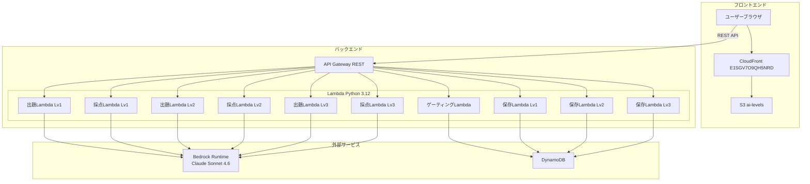
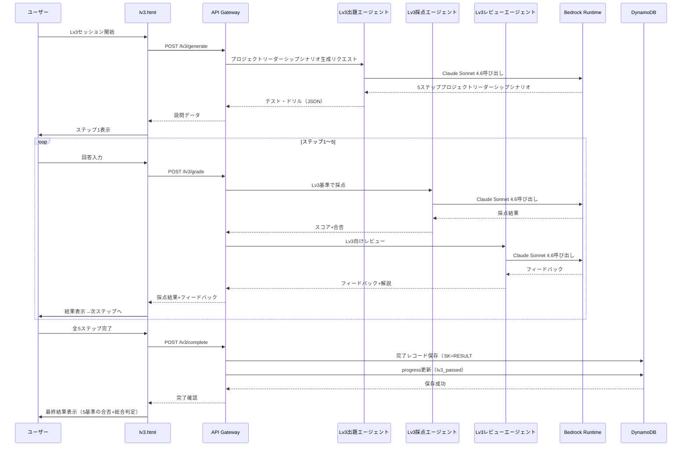

# デザインドキュメント: AI Levels Lv3 カリキュラム

## 概要

AI Levels Lv3は、Lv2合格者を対象としたプロジェクトリーダーシップカリキュラムである。テーマは「AI活用プロジェクトリーダーシップ×チームAI戦略策定×AI導入計画立案×スキル育成計画×ROI評価改善」で、5ステップのプロジェクトリーダーシップシナリオ形式テストを通じて受講者の戦略立案・推進力を測定する。

既存のLv1・Lv2アーキテクチャ（Lambda + Bedrock + DynamoDB + 3エージェントパイプライン）を最大限再利用し、Lv3固有のシステムプロンプト・テスト設計・フロントエンドを追加する。共通モジュール（`bedrock_client.py`）はそのまま利用し、Lv3用ハンドラは既存Lv2ハンドラと同一パターンで新規作成する。

### Lv2との主な差分

| 項目 | Lv2 | Lv3 |
|------|-----|-----|
| テーマ | 業務プロセス設計×AI実行指示×成果物検証×改善サイクル | AI活用プロジェクトリーダーシップ×チームAI戦略策定×AI導入計画立案×スキル育成計画×ROI評価改善 |
| 設問数 | 4問（ケーススタディ4ステップ） | 5問（プロジェクトリーダーシップシナリオ5ステップ） |
| 設問形式 | 同一業務シナリオに基づく連続ステップ | 同一組織シナリオに基づくプロジェクトリーダーシップシナリオ |
| ステップ構成 | S1:scenario, S2:free_text, S3:scenario, S4:free_text | S1:scenario, S2:free_text, S3:scenario, S4:scenario, S5:free_text |
| 採点基準 | プロセス具体性・指示構造化度・検証的確さ・改善実現可能性 | プロジェクト計画の実現可能性・戦略の論理的整合性・導入計画の具体性・育成プランの段階性・ROI評価の定量性 |
| 合格基準 | 各基準60点以上（4基準すべて） | 各基準60点以上（5基準すべて） |
| SK | RESULT#lv2 | RESULT#lv3 |
| エンドポイント | /lv2/* | /lv3/* |
| ゲーティング | Lv1合格→Lv2解放 | Lv2合格→Lv3解放、Lv3合格→Lv4解放 |
| セッションキー | ai_levels_lv2_session | ai_levels_lv3_session |

## アーキテクチャ

### システム構成図



### Lv3パイプラインフロー



## コンポーネントとインターフェース

### APIエンドポイント（Lv3追加分）

| メソッド | パス | 説明 | Lambda |
|---------|------|------|--------|
| POST | /lv3/generate | Lv3プロジェクトリーダーシップシナリオ生成 | lv3_generate_handler |
| POST | /lv3/grade | Lv3回答採点+レビュー | lv3_grade_handler |
| POST | /lv3/complete | Lv3完了レコード保存 | lv3_complete_handler |
| GET | /levels/status | レベル合格状態取得（Lv3対応拡張） | gate_handler（既存拡張） |

### Lv3出題エージェント（Test_Generator）

```python
# backend/handlers/lv3_generate_handler.py
def handler(event, context):
    """
    POST /lv3/generate
    リクエスト: { "session_id": str }
    レスポンス: {
        "session_id": str,
        "questions": [
            {
                "step": 1,
                "type": "scenario",
                "prompt": "AI活用プロジェクトリーダーシップの設問文",
                "options": null,
                "context": "組織のAI活用課題シナリオ"
            },
            {
                "step": 2,
                "type": "free_text",
                "prompt": "チームAI戦略策定の設問文",
                "options": null,
                "context": "ステップ1の組織状況に基づく戦略策定の文脈"
            },
            {
                "step": 3,
                "type": "scenario",
                "prompt": "AI導入計画立案の設問文",
                "options": null,
                "context": "具体的なAI導入対象業務シナリオ"
            },
            {
                "step": 4,
                "type": "scenario",
                "prompt": "スキル育成計画の設問文",
                "options": null,
                "context": "チームメンバーのスキル状況データ"
            },
            {
                "step": 5,
                "type": "free_text",
                "prompt": "ROI評価改善の設問文",
                "options": null,
                "context": "AI活用の実績データ"
            }
        ]
    }
    """
```

Lv3システムプロンプト設計方針:
- カリキュラム「AI活用プロジェクトリーダーシップ×チームAI戦略策定×AI導入計画立案×スキル育成計画×ROI評価改善」をシステムプロンプトに埋め込む
- コンサルティング業務で実際に発生しうるAI導入プロジェクトの組織シナリオを生成するよう指示
- 5問すべてが同一組織シナリオに基づく一貫したプロジェクトリーダーシップシナリオとなるよう指示
- ステップ間の依存関係（ステップ2はステップ1の組織状況を前提とする等）を明示
- 毎回異なるシナリオを生成するためランダム性を指示

```python
LV3_GENERATE_SYSTEM_PROMPT = """AIカリキュラム「AI活用プロジェクトリーダーシップ×チームAI戦略策定×AI導入計画立案×スキル育成計画×ROI評価改善」の出題エージェント。
コンサルティング業務で実際に発生しうるAI導入プロジェクトの組織シナリオに基づく5ステップのプロジェクトリーダーシップシナリオを生成せよ。
5問すべてが同一の組織シナリオに基づき、一貫性のあるプロジェクトリーダーシップシナリオとすること。
毎回異なる組織シナリオを使うこと。

ステップ構成:
- ステップ1（AI活用プロジェクトリーダーシップ）: scenario形式 — 組織のAI活用課題を提示し、プロジェクト計画（目的・スコープ・体制・スケジュール）の策定を求める
- ステップ2（チームAI戦略策定）: free_text形式 — ステップ1の組織状況に基づき、チーム全体のAI活用ロードマップ（短期・中期・長期）の策定を求める
- ステップ3（AI導入計画立案）: scenario形式 — 具体的なAI導入対象業務を提示し、実行計画・リソース配分・リスク対策を含む導入計画の立案を求める
- ステップ4（スキル育成計画）: scenario形式 — チームメンバーのスキル状況データを提示し、段階的な育成プランと評価指標の設計を求める
- ステップ5（ROI評価改善）: free_text形式 — AI活用の実績データを提示し、定量的なROI評価と改善施策の立案を求める

出力JSON形式（これ以外のテキスト禁止）:
{"questions":[{"step":1,"type":"scenario","prompt":"設問文","options":null,"context":"組織シナリオ説明"},{"step":2,"type":"free_text","prompt":"設問文","options":null,"context":"文脈説明"},{"step":3,"type":"scenario","prompt":"設問文","options":null,"context":"AI導入対象業務シナリオ"},{"step":4,"type":"scenario","prompt":"設問文","options":null,"context":"スキル状況データ"},{"step":5,"type":"free_text","prompt":"設問文","options":null,"context":"実績データ"}]}

typeは "scenario" または "free_text" のみ。stepは1〜5の連番。contextは必ず含めること。"""
```

### Lv3採点エージェント（Grader）

```python
# backend/handlers/lv3_grade_handler.py
def handler(event, context):
    """
    POST /lv3/grade
    リクエスト: {
        "session_id": str,
        "step": int,          # 1〜5
        "question": { ... },
        "answer": str
    }
    レスポンス: {
        "session_id": str,
        "step": int,
        "passed": bool,       # score >= 60
        "score": int,         # 0〜100
        "feedback": str,
        "explanation": str
    }
    """
```

Lv3採点基準（ステップごとに異なる基準を適用）:

```python
LV3_GRADE_SYSTEM_PROMPT = """あなたはAIカリキュラム「AI活用プロジェクトリーダーシップ×チームAI戦略策定×AI導入計画立案×スキル育成計画×ROI評価改善」の採点エージェントです。

ステップごとの採点基準:
- ステップ1（AI活用プロジェクトリーダーシップ）: プロジェクトの目的・スコープが明確か、体制設計が適切か、スケジュールが実現可能か、組織課題を的確に捉えているか
- ステップ2（チームAI戦略策定）: 短期・中期・長期の区分が明確か、ロードマップが論理的に整合しているか、チームの現状分析に基づいているか、段階的な導入戦略が具体的か
- ステップ3（AI導入計画立案）: 実行計画が具体的か、リソース配分が適切か、リスク対策が網羅的か、マイルストーンが明確か
- ステップ4（スキル育成計画）: メンバーのスキルレベル評価が適切か、育成プランが段階的か、評価指標が測定可能か、個別対応が考慮されているか
- ステップ5（ROI評価改善）: ROI評価が定量的か、データに基づく分析か、改善施策が具体的か、実現可能性が考慮されているか

出力は必ず以下のJSON形式で返してください。それ以外のテキストは含めないでください:
{
  "passed": true または false,
  "score": 0〜100の整数
}

60点以上を合格とする。"""
```

### Lv3レビューエージェント（Reviewer）

```python
# backend/lib/lv3_reviewer.py
LV3_REVIEW_SYSTEM_PROMPT = """あなたはAIカリキュラム「AI活用プロジェクトリーダーシップ×チームAI戦略策定×AI導入計画立案×スキル育成計画×ROI評価改善」のレビューエージェントです。

採点結果をもとに、学習者に対するフィードバックと解説を生成してください。

フィードバックでは:
- 回答の良かった点と改善点を具体的に指摘する
- プロジェクトリーダーとしての具体的な改善アクションを含める
- Lv3の学習目標（AI活用プロジェクトリーダーシップ・チームAI戦略策定・AI導入計画立案・スキル育成計画・ROI評価改善）に沿った助言を行う
- ベストプラクティスを含める

解説では:
- 正解の考え方や背景知識を説明する
- コンサルティング実務でのプロジェクトリーダーシップ応用例を含める

出力は必ず以下のJSON形式で返してください。それ以外のテキストは含めないでください:
{
  "feedback": "フィードバック文",
  "explanation": "解説文"
}"""

def generate_lv3_feedback(question: dict, answer: str, grade_result: dict) -> dict:
    """Lv3用フィードバック・解説を生成する。Lv2のlv2_reviewer.pyと同一パターン。"""
```

### Lv3完了保存ハンドラ

```python
# backend/handlers/lv3_complete_handler.py
def handler(event, context):
    """
    POST /lv3/complete
    リクエスト: {
        "session_id": str,
        "questions": [...],
        "answers": [...],
        "grades": [...],
        "final_passed": bool
    }
    レスポンス: { "saved": bool, "record_id": str }
    """
```

Lv2の`lv2_complete_handler.py`と同一パターンだが以下が異なる:
- SK: `RESULT#lv3`（Lv2は`RESULT#lv2`）
- level: `"lv3"`
- `_update_progress`で`lv3_passed`フラグを更新（既存のlv1_passed・lv2_passedは保持）

### ゲーティングハンドラ拡張

既存の`gate_handler.py`の`_build_levels`関数を拡張し、`lv3_passed`も受け取るようにする:

```python
def _build_levels(lv1_passed: bool, lv2_passed: bool, lv3_passed: bool) -> dict:
    """Build the levels status dict based on progress."""
    return {
        "lv1": {"unlocked": True, "passed": lv1_passed},
        "lv2": {"unlocked": lv1_passed, "passed": lv2_passed},
        "lv3": {"unlocked": lv2_passed, "passed": lv3_passed},
        "lv4": {"unlocked": lv3_passed, "passed": False},
    }
```

`handler`関数も`lv3_passed`を取得するよう拡張:

```python
def handler(event, context):
    # ... 既存のsession_idバリデーション ...
    item = resp.get("Item")
    lv1_passed = item.get("lv1_passed", False) if item else False
    lv2_passed = item.get("lv2_passed", False) if item else False
    lv3_passed = item.get("lv3_passed", False) if item else False

    return {
        "statusCode": 200,
        "headers": CORS_HEADERS,
        "body": json.dumps({"levels": _build_levels(lv1_passed, lv2_passed, lv3_passed)}),
    }
```

### フロントエンド構成（Lv3追加分）

```
frontend/
├── index.html          # Lv3カード更新（リンク追加）
├── lv3.html            # Lv3プロジェクトリーダーシップシナリオ実行画面（新規）
├── css/
│   └── style.css       # Lv3用スタイル追加
└── js/
    ├── app.js          # Lv1用（変更なし）
    ├── lv2-app.js      # Lv2用（変更なし）
    ├── lv3-app.js      # Lv3用アプリケーションロジック（新規）
    ├── api.js          # Lv3エンドポイント追加
    ├── gate.js         # ゲーティングロジック（変更なし）
    └── config.js       # API Base URL（変更なし）
```

#### lv3.htmlの設計

- Lv2の`lv2.html`と同一レイアウト構造を踏襲
- プロジェクトリーダーシップシナリオ形式に適したUI:
  - 組織状況表示エリアの拡大（contextフィールドを目立つカードで表示）
  - 戦略記述用の構造化テキストエリア（rows拡大、文字数カウンター付き）
  - データ表示エリア（スキル状況データ・実績データの表示用）
  - ステップ間の進行状況を5ステップで表示
- ページ読み込み時にLv2合格状態を検証し、未合格の場合は`index.html`にリダイレクト

#### api.jsの拡張

```javascript
// Lv3用エンドポイント追加
function lv3Generate(sessionId) {
  return request("/lv3/generate", {
    method: "POST",
    body: JSON.stringify({ session_id: sessionId }),
  });
}

function lv3Grade(sessionId, step, question, answer) {
  return request("/lv3/grade", {
    method: "POST",
    body: JSON.stringify({ session_id: sessionId, step, question, answer }),
  });
}

function lv3Complete(payload) {
  return request("/lv3/complete", {
    method: "POST",
    body: JSON.stringify(payload),
  });
}
```

#### index.htmlのLv3カード更新

Lv3カードの「Coming Soon」を実際のカリキュラム情報に更新し、`lv3.html`へのリンクを設定:

```html
<div class="index-row level-card level-card--locked" id="level-lv3" data-level="lv3" hidden>
  <div class="level-card__badge">Lv3</div>
  <div class="index-row__info">
    <h2 class="level-card__title">AI活用プロジェクトリーダーシップ×チームAI戦略策定×AI導入計画立案×スキル育成計画×ROI評価改善</h2>
    <p class="level-card__desc">プロジェクトリーダーシップシナリオ形式でAI活用推進力を確認します。</p>
  </div>
  <div class="level-card__status" id="status-lv3"></div>
  <a href="lv3.html" class="level-card__btn">開始する</a>
</div>
```

## データモデル

### DynamoDBテーブル設計（Lv3追加分）

既存テーブルをそのまま利用。Lv3データはSKで区別する。

#### テーブル: ai-levels-results（Lv3レコード）

| 属性 | 型 | 説明 |
|------|-----|------|
| PK | String | `SESSION#{session_id}` |
| SK | String | `RESULT#lv3` |
| session_id | String | セッション識別子（UUID） |
| level | String | `"lv3"` |
| questions | List | 全5設問データ |
| answers | List | 全5回答データ |
| grades | List | 全5採点結果（各基準のスコア含む） |
| final_passed | Boolean | 最終合否（全5基準60点以上） |
| total_score | Number | 合計スコア |
| completed_at | String | 完了タイムスタンプ（ISO 8601） |

#### テーブル: ai-levels-progress（Lv3対応）

既存のprogressテーブルの`lv3_passed`フィールドを実際に使用する（Lv1・Lv2実装時にすでにフィールドは定義済み）。

| 属性 | 型 | 説明 |
|------|-----|------|
| PK | String | `SESSION#{session_id}` |
| SK | String | `PROGRESS` |
| lv1_passed | Boolean | Lv1合格フラグ |
| lv2_passed | Boolean | Lv2合格フラグ |
| lv3_passed | Boolean | Lv3合格フラグ（今回から実使用） |
| lv4_passed | Boolean | Lv4合格フラグ（将来用） |
| updated_at | String | 更新タイムスタンプ |

### Lv3完了レコード保存時の注意点

`lv3_complete_handler`の`_update_progress`では、既存の`lv1_passed`と`lv2_passed`を保持しつつ`lv3_passed`のみ更新する。Lv2の`lv2_complete_handler`が`put_item`で全フィールドを上書きするパターンを踏襲するが、既存のprogressレコードを先に`get_item`で取得し、`lv1_passed`と`lv2_passed`の値を保持する:

```python
def _update_progress(dynamodb, session_id: str, final_passed: bool, updated_at: str):
    """Update the lv3_passed flag while preserving existing progress."""
    table = dynamodb.Table(PROGRESS_TABLE)
    # 既存レコードを取得してlv1_passed・lv2_passedを保持
    resp = table.get_item(Key={"PK": f"SESSION#{session_id}", "SK": "PROGRESS"})
    existing = resp.get("Item", {})
    table.put_item(Item={
        "PK": f"SESSION#{session_id}",
        "SK": "PROGRESS",
        "session_id": session_id,
        "lv1_passed": existing.get("lv1_passed", False),
        "lv2_passed": existing.get("lv2_passed", False),
        "lv3_passed": final_passed,
        "lv4_passed": False,
        "updated_at": updated_at,
    })
```

### セッションデータ（フロントエンド sessionStorage）

Lv3用のセッションキーはLv1・Lv2と分離する:

```json
{
  "session_id": "uuid-v4",
  "current_step": 0,
  "questions": [],
  "answers": [],
  "grades": [],
  "started_at": "ISO 8601"
}
```

キー名: `ai_levels_lv3_session`（Lv2は`ai_levels_lv2_session`、Lv1は`ai_levels_session`）

### serverless.yml拡張

```yaml
functions:
  # 既存Lv1関数（変更なし）
  generate:
    handler: backend/handlers/generate_handler.handler
    events:
      - http:
          path: lv1/generate
          method: post
          cors: true
  grade:
    handler: backend/handlers/grade_handler.handler
    events:
      - http:
          path: lv1/grade
          method: post
          cors: true
  complete:
    handler: backend/handlers/complete_handler.handler
    events:
      - http:
          path: lv1/complete
          method: post
          cors: true
  gate:
    handler: backend/handlers/gate_handler.handler
    events:
      - http:
          path: levels/status
          method: get
          cors: true

  # 既存Lv2関数（変更なし）
  lv2Generate:
    handler: backend/handlers/lv2_generate_handler.handler
    events:
      - http:
          path: lv2/generate
          method: post
          cors: true
  lv2Grade:
    handler: backend/handlers/lv2_grade_handler.handler
    events:
      - http:
          path: lv2/grade
          method: post
          cors: true
  lv2Complete:
    handler: backend/handlers/lv2_complete_handler.handler
    events:
      - http:
          path: lv2/complete
          method: post
          cors: true

  # Lv3関数（新規追加）
  lv3Generate:
    handler: backend/handlers/lv3_generate_handler.handler
    events:
      - http:
          path: lv3/generate
          method: post
          cors: true
  lv3Grade:
    handler: backend/handlers/lv3_grade_handler.handler
    events:
      - http:
          path: lv3/grade
          method: post
          cors: true
  lv3Complete:
    handler: backend/handlers/lv3_complete_handler.handler
    events:
      - http:
          path: lv3/complete
          method: post
          cors: true
```

DynamoDBテーブルとIAMロールは既存のものをそのまま利用（変更不要）。


## 正当性プロパティ

*プロパティとは、システムの全ての有効な実行において成り立つべき特性や振る舞いのことである。人間が読める仕様と機械的に検証可能な正当性保証の橋渡しとなる形式的な記述である。*

### Property 1: Lv3生成結果の構造的正当性

*任意の*セッションIDに対して、Lv3 Test_Generatorが返す生成結果は、questions配列を含み、要素数が正確に5であること。各要素はstep（1〜5の連番）、type（ステップ1,3,4は"scenario"、ステップ2,5は"free_text"）、prompt（空でない文字列）、context（空でない文字列）を持つ正しいJSON構造であること。

**Validates: Requirements 3.1, 3.2, 4.1, 4.3, 4.4**

### Property 2: Lv3生成結果のランダム性

*任意の*セッションIDに対して、Lv3 Test_Generatorを2回呼び出した場合、生成されるプロジェクトリーダーシップシナリオの内容（promptフィールドまたはcontextフィールド）が完全一致しないこと。

**Validates: Requirements 3.3**

### Property 3: Lv3採点結果の構造的正当性と合格閾値

*任意の*Lv3設問と回答の組み合わせに対して、Graderが返す採点結果は、passed（bool型）とscore（0〜100の整数）を含み、passedの値はscore >= 60と一致すること。

**Validates: Requirements 2.2, 5.1, 5.3**

### Property 4: Lv3最終合否判定の正当性

*任意の*5つの採点結果の組み合わせに対して、final_passedがtrueとなるのは全5基準のスコアが60点以上の場合のみであること。

**Validates: Requirements 2.3**

### Property 5: Lv3レビュー結果の構造的正当性

*任意の*Lv3採点結果に対して、Reviewerが返すレビュー結果は、feedback（空でない文字列）とexplanation（空でない文字列）の両フィールドを含むこと。

**Validates: Requirements 6.1**

### Property 6: Lv3完了レコードの完全性

*任意の*Lv3完了データに対して、DynamoDBに保存されるレコードは、PK（SESSION#{session_id}）、SK（RESULT#lv3）、session_id、completed_at（ISO 8601タイムスタンプ）、level（"lv3"）、questions、answers、grades、final_passedの全フィールドを含むこと。

**Validates: Requirements 8.1, 8.3, 8.4**

### Property 7: Lv3途中セッションでのDB非書き込み

*任意の*lv3_generate_handlerまたはlv3_grade_handlerへのリクエストに対して、DynamoDBへの書き込み操作が発生しないこと。

**Validates: Requirements 8.2**

### Property 8: Lv3ゲーティングロジックの正当性

*任意の*セッション状態に対して、Lv2が合格していない場合はLv3のunlockedがfalseであること。Lv2が合格している場合のみLv3のunlockedがtrueになること。Lv3が合格している場合のみLv4のunlockedがtrueになること。

**Validates: Requirements 9.1, 9.2, 9.4, 11.5**

### Property 9: Lv3合格時のprogressフラグ更新

*任意の*Lv3完了リクエストに対して、final_passedがtrueの場合、progressテーブルのlv3_passedがtrueに更新されること。かつ、既存のlv1_passedフラグおよびlv2_passedフラグが保持されること。

**Validates: Requirements 9.3**

### Property 10: Lv3エンドポイントのCORSヘッダー

*任意の*Lv3エンドポイント（/lv3/generate、/lv3/grade、/lv3/complete）へのリクエストに対して、レスポンスにAccess-Control-Allow-Origin: *ヘッダーが含まれること。

**Validates: Requirements 11.6**

## エラーハンドリング

### Bedrock Runtime呼び出しエラー（Lv1・Lv2と同一）

既存の`bedrock_client.py`の指数バックオフリトライ機構をそのまま利用する。

| エラー種別 | 対応 |
|-----------|------|
| ThrottlingException | 指数バックオフで最大3回リトライ |
| ModelTimeoutException | タイムアウトエラーをユーザーに通知、リトライ促進 |
| ValidationException | リクエストパラメータを検証しエラーログ記録 |
| ServiceUnavailableException | サービス一時停止メッセージをユーザーに表示 |

### DynamoDB書き込みエラー（Lv3固有の考慮点）

| エラー種別 | 対応 |
|-----------|------|
| ClientError（全般） | エラーログ記録、ユーザーにリトライ可能な旨を通知（要件8.5） |
| get_item失敗（progress取得） | 既存progressが取得できない場合、lv1_passed=False、lv2_passed=Falseとしてフォールバック |

### Lv3固有のバリデーション

- `lv3_generate_handler`: session_idの形式（UUID v4）を検証
- `lv3_grade_handler`: session_id、step（1〜5）、question（dict）、answer（非空文字列）を検証
- `lv3_complete_handler`: Lv2と同一のバリデーション（session_id、questions、answers、grades、final_passed）
- 全Lv3エンドポイントで不正なJSONリクエストに対して400 Bad Requestを返却

### フロントエンドエラーハンドリング（Lv1・Lv2と同一パターン）

- API呼び出し失敗時はユーザーにリトライボタンを表示
- ネットワークエラー時は接続状態を確認するメッセージを表示
- lv3.htmlアクセス時のLv2合格検証失敗時はindex.htmlにリダイレクト

## テスト戦略

### テストフレームワーク

- **バックエンド**: pytest + pytest-mock（ユニットテスト）、hypothesis（プロパティベーステスト）
- **フロントエンド**: 手動テスト（Lv1・Lv2と同一方針）

### プロパティベーステスト

プロパティベーステストライブラリとして**hypothesis**（Python）を使用する。

各プロパティテストは最低100回のイテレーションで実行する。各テストにはデザインドキュメントのプロパティ番号を参照するコメントタグを付与する。

タグ形式: **Feature: ai-levels-lv3-curriculum, Property {number}: {property_text}**

各正当性プロパティは1つのプロパティベーステストで実装する。

### ユニットテスト

ユニットテストはプロパティベーステストを補完し、以下に焦点を当てる:
- 具体的な入出力例の検証（正常系・異常系）
- エッジケース（空文字列、境界値スコア0/60/100、不正なJSON等）
- DynamoDB保存失敗時のエラーハンドリング（要件8.5）
- Bedrock呼び出しのモック検証（正しいリージョン・モデルID）
- パイプライン順序の検証（Test_Generator → Grader → Reviewer）
- Lv3固有のシステムプロンプトが使用されていることの検証
- lv3_complete_handlerがlv1_passedおよびlv2_passedを保持することの検証
- gate_handlerの`_build_levels`が3引数（lv1_passed, lv2_passed, lv3_passed）を受け取ることの検証
- lv3_grade_handlerのstepバリデーション範囲が1〜5であることの検証

### テスト構成

```
tests/
├── unit/
│   ├── test_generate_handler.py       # 既存Lv1
│   ├── test_grade_handler.py          # 既存Lv1
│   ├── test_complete_handler.py       # 既存Lv1
│   ├── test_gate_handler.py           # 既存Lv1（Lv3対応テスト追加: _build_levels 3引数化）
│   ├── test_bedrock_client.py         # 既存
│   ├── test_reviewer.py               # 既存Lv1
│   ├── test_lv2_generate_handler.py   # 既存Lv2
│   ├── test_lv2_grade_handler.py      # 既存Lv2
│   ├── test_lv2_complete_handler.py   # 既存Lv2
│   ├── test_lv2_reviewer.py           # 既存Lv2
│   ├── test_lv3_generate_handler.py   # 新規
│   ├── test_lv3_grade_handler.py      # 新規
│   ├── test_lv3_complete_handler.py   # 新規
│   └── test_lv3_reviewer.py           # 新規
└── property/
    ├── test_generate_properties.py     # 既存Lv1
    ├── test_grade_properties.py        # 既存Lv1
    ├── test_review_properties.py       # 既存Lv1
    ├── test_complete_properties.py     # 既存Lv1
    ├── test_gate_properties.py         # 既存Lv1（Lv3対応テスト追加）
    ├── test_auth_properties.py         # 既存Lv1
    ├── test_lv2_generate_properties.py # 既存Lv2
    ├── test_lv2_grade_properties.py    # 既存Lv2
    ├── test_lv2_review_properties.py   # 既存Lv2
    ├── test_lv2_complete_properties.py # 既存Lv2
    ├── test_lv2_gate_properties.py     # 既存Lv2
    ├── test_lv2_cors_properties.py     # 既存Lv2
    ├── test_lv3_generate_properties.py # 新規（Property 1, 2）
    ├── test_lv3_grade_properties.py    # 新規（Property 3, 4）
    ├── test_lv3_review_properties.py   # 新規（Property 5）
    ├── test_lv3_complete_properties.py # 新規（Property 6, 7, 9）
    ├── test_lv3_gate_properties.py     # 新規（Property 8）
    └── test_lv3_cors_properties.py     # 新規（Property 10）
```
