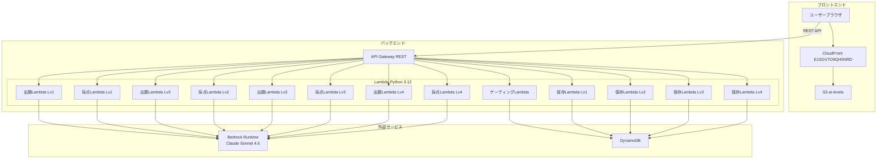
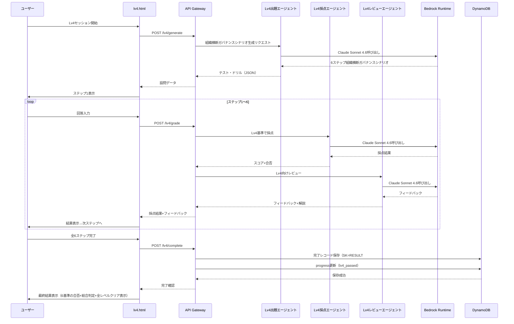

# デザインドキュメント: AI Levels Lv4 カリキュラム

## 概要

AI Levels Lv4は、Lv3合格者を対象とした組織横断ガバナンスカリキュラムである。テーマは「組織横断AI活用標準化×ガバナンス設計×持続的AI活用文化構築」で、6ステップの組織横断ガバナンスシナリオ形式テストを通じて受講者の組織全体のAI活用推進力を測定する。

既存のLv1〜Lv3アーキテクチャ（Lambda + Bedrock + DynamoDB + 3エージェントパイプライン）を最大限再利用し、Lv4固有のシステムプロンプト・テスト設計・フロントエンドを追加する。共通モジュール（`bedrock_client.py`）はそのまま利用し、Lv4用ハンドラは既存Lv3ハンドラと同一パターンで新規作成する。

Lv4合格は全レベル（Lv1〜Lv4）のクリアを意味し、AI Levelsカリキュラム全体の修了となる。

### Lv3との主な差分

| 項目 | Lv3 | Lv4 |
|------|-----|-----|
| テーマ | AI活用プロジェクトリーダーシップ×チームAI戦略策定×AI導入計画立案×スキル育成計画×ROI評価改善 | 組織横断AI活用標準化×ガバナンス設計×持続的AI活用文化構築 |
| 設問数 | 5問（プロジェクトリーダーシップシナリオ5ステップ） | 6問（組織横断ガバナンスシナリオ6ステップ） |
| 設問形式 | 同一組織シナリオに基づくプロジェクトリーダーシップシナリオ | 同一組織シナリオに基づく組織横断ガバナンスシナリオ |
| ステップ構成 | S1:scenario, S2:free_text, S3:scenario, S4:scenario, S5:free_text | S1:scenario, S2:free_text, S3:scenario, S4:free_text, S5:scenario, S6:free_text |
| 採点基準 | プロジェクト計画の実現可能性・戦略の論理的整合性・導入計画の具体性・育成プランの段階性・ROI評価の定量性 | 標準化方針の網羅性・ガバナンス設計の包括性・推進体制の実効性・文化醸成プログラムの段階性・リスク管理の網羅性・ロードマップの実現可能性 |
| 合格基準 | 各基準60点以上（5基準すべて） | 各基準60点以上（6基準すべて） |
| SK | RESULT#lv3 | RESULT#lv4 |
| エンドポイント | /lv3/* | /lv4/* |
| ゲーティング | Lv2合格→Lv3解放 | Lv3合格→Lv4解放 |
| セッションキー | ai_levels_lv3_session | ai_levels_lv4_session |
| 合格後の表示 | Lv4解放 | 全レベルクリア祝福メッセージ |
| gate_handler | _build_levels 3引数 | _build_levels 4引数（lv1_passed, lv2_passed, lv3_passed, lv4_passed） |

## アーキテクチャ

### システム構成図



### Lv4パイプラインフロー



## コンポーネントとインターフェース

### APIエンドポイント（Lv4追加分）

| メソッド | パス | 説明 | Lambda |
|---------|------|------|--------|
| POST | /lv4/generate | Lv4組織横断ガバナンスシナリオ生成 | lv4_generate_handler |
| POST | /lv4/grade | Lv4回答採点+レビュー | lv4_grade_handler |
| POST | /lv4/complete | Lv4完了レコード保存 | lv4_complete_handler |
| GET | /levels/status | レベル合格状態取得（Lv4対応拡張） | gate_handler（既存拡張） |

### Lv4出題エージェント（Test_Generator）

```python
# backend/handlers/lv4_generate_handler.py
def handler(event, context):
    """
    POST /lv4/generate
    リクエスト: { "session_id": str }
    レスポンス: {
        "session_id": str,
        "questions": [
            {
                "step": 1,
                "type": "scenario",
                "prompt": "AI活用標準化戦略の設問文",
                "options": null,
                "context": "組織全体のAI活用状況シナリオ"
            },
            {
                "step": 2,
                "type": "free_text",
                "prompt": "ガバナンスフレームワーク設計の設問文",
                "options": null,
                "context": "ステップ1の組織状況に基づくガバナンス設計の文脈"
            },
            {
                "step": 3,
                "type": "scenario",
                "prompt": "組織横断AI推進体制構築の設問文",
                "options": null,
                "context": "複数部門のAI活用課題シナリオ"
            },
            {
                "step": 4,
                "type": "free_text",
                "prompt": "AI活用文化醸成プログラムの設問文",
                "options": null,
                "context": "組織の現状文化と変革課題"
            },
            {
                "step": 5,
                "type": "scenario",
                "prompt": "リスク管理・コンプライアンスの設問文",
                "options": null,
                "context": "AI活用に伴うリスクシナリオ"
            },
            {
                "step": 6,
                "type": "free_text",
                "prompt": "中長期AI活用ロードマップの設問文",
                "options": null,
                "context": "組織全体のAI活用実績データ"
            }
        ]
    }
    """
```

Lv4システムプロンプト設計方針:
- カリキュラム「組織横断AI活用標準化×ガバナンス設計×持続的AI活用文化構築」をシステムプロンプトに埋め込む
- コンサルティング業務で実際に発生しうる大規模組織のAI活用標準化・ガバナンス課題を生成するよう指示
- 6問すべてが同一組織シナリオに基づく一貫した組織横断ガバナンスシナリオとなるよう指示
- ステップ間の依存関係（ステップ2はステップ1の組織状況を前提とする等）を明示
- 毎回異なるシナリオを生成するためランダム性を指示

```python
LV4_GENERATE_SYSTEM_PROMPT = """AIカリキュラム「組織横断AI活用標準化×ガバナンス設計×持続的AI活用文化構築」の出題エージェント。
コンサルティング業務で実際に発生しうる大規模組織のAI活用標準化・ガバナンス課題に基づく6ステップの組織横断ガバナンスシナリオを生成せよ。
6問すべてが同一の組織シナリオに基づき、一貫性のある組織横断ガバナンスシナリオとすること。
毎回異なる組織シナリオを使うこと。

ステップ構成:
- ステップ1（AI活用標準化戦略）: scenario形式 — 組織全体のAI活用状況を提示し、標準化された活用方針・ガイドラインの策定を求める
- ステップ2（ガバナンスフレームワーク設計）: free_text形式 — ステップ1の組織状況に基づき、AI活用のポリシー・ルール・監査体制を含む包括的なガバナンスフレームワークの設計を求める
- ステップ3（組織横断AI推進体制構築）: scenario形式 — 複数部門のAI活用課題を提示し、横断的な推進体制・意思決定プロセス・コミュニケーション設計を求める
- ステップ4（AI活用文化醸成プログラム）: free_text形式 — 組織の現状文化を分析し、段階的な変革プログラム・成功指標・定着化施策の設計を求める
- ステップ5（リスク管理・コンプライアンス）: scenario形式 — AI活用に伴うリスクシナリオを提示し、法規制・倫理基準への準拠を含む包括的なリスク管理体制の設計を求める
- ステップ6（中長期AI活用ロードマップ）: free_text形式 — 組織全体のAI活用実績データを提示し、中長期AI活用計画と定量的な成果指標（KPI）の策定を求める

出力JSON形式（これ以外のテキスト禁止）:
{"questions":[{"step":1,"type":"scenario","prompt":"設問文","options":null,"context":"組織シナリオ説明"},{"step":2,"type":"free_text","prompt":"設問文","options":null,"context":"文脈説明"},{"step":3,"type":"scenario","prompt":"設問文","options":null,"context":"複数部門課題シナリオ"},{"step":4,"type":"free_text","prompt":"設問文","options":null,"context":"組織文化の現状"},{"step":5,"type":"scenario","prompt":"設問文","options":null,"context":"リスクシナリオ"},{"step":6,"type":"free_text","prompt":"設問文","options":null,"context":"AI活用実績データ"}]}

typeは "scenario" または "free_text" のみ。stepは1〜6の連番。contextは必ず含めること。"""
```

### Lv4採点エージェント（Grader）

```python
# backend/handlers/lv4_grade_handler.py
def handler(event, context):
    """
    POST /lv4/grade
    リクエスト: {
        "session_id": str,
        "step": int,          # 1〜6
        "question": { ... },
        "answer": str
    }
    レスポンス: {
        "session_id": str,
        "step": int,
        "passed": bool,       # score >= 60
        "score": int,         # 0〜100
        "feedback": str,
        "explanation": str
    }
    """
```

Lv4採点基準（ステップごとに異なる基準を適用）:

```python
LV4_GRADE_SYSTEM_PROMPT = """あなたはAIカリキュラム「組織横断AI活用標準化×ガバナンス設計×持続的AI活用文化構築」の採点エージェントです。

ステップごとの採点基準:
- ステップ1（AI活用標準化戦略）: 組織全体のAI活用状況分析が的確か、標準化方針が部門横断で適用可能か、ガイドラインが具体的か
- ステップ2（ガバナンスフレームワーク設計）: ポリシー・ルールが包括的か、監査体制が実効的か、責任分担が明確か
- ステップ3（組織横断AI推進体制構築）: 複数部門の課題把握が的確か、推進体制が実効的か、意思決定プロセスが明確か、コミュニケーション設計が具体的か
- ステップ4（AI活用文化醸成プログラム）: 現状文化の分析が的確か、変革プログラムが段階的か、成功指標が測定可能か、定着化施策が具体的か
- ステップ5（リスク管理・コンプライアンス）: リスクシナリオの特定が網羅的か、法規制・倫理基準への準拠が考慮されているか、リスク管理体制が包括的か
- ステップ6（中長期AI活用ロードマップ）: 中長期計画が実現可能か、KPIが定量的か、評価サイクルが設計されているか、組織全体の視点があるか

出力は必ず以下のJSON形式で返してください。それ以外のテキストは含めないでください:
{
  "passed": true または false,
  "score": 0〜100の整数
}

60点以上を合格とする。"""
```

### Lv4レビューエージェント（Reviewer）

```python
# backend/lib/lv4_reviewer.py
LV4_REVIEW_SYSTEM_PROMPT = """あなたはAIカリキュラム「組織横断AI活用標準化×ガバナンス設計×持続的AI活用文化構築」のレビューエージェントです。

採点結果をもとに、学習者に対するフィードバックと解説を生成してください。

フィードバックでは:
- 回答の良かった点と改善点を具体的に指摘する
- 組織横断AI推進者としての具体的な改善アクションを含める
- Lv4の学習目標（組織横断AI活用標準化・ガバナンス設計・持続的AI活用文化構築）に沿った助言を行う
- ベストプラクティスや実務での応用ポイントを含める

解説では:
- 正解の考え方や背景知識を説明する
- コンサルティング実務での組織横断ガバナンス応用例を含める

出力は必ず以下のJSON形式で返してください。それ以外のテキストは含めないでください:
{
  "feedback": "フィードバック文",
  "explanation": "解説文"
}"""

def generate_lv4_feedback(question: dict, answer: str, grade_result: dict) -> dict:
    """Lv4用フィードバック・解説を生成する。Lv3のlv3_reviewer.pyと同一パターン。"""
```

### Lv4完了保存ハンドラ

```python
# backend/handlers/lv4_complete_handler.py
def handler(event, context):
    """
    POST /lv4/complete
    リクエスト: {
        "session_id": str,
        "questions": [...],
        "answers": [...],
        "grades": [...],
        "final_passed": bool
    }
    レスポンス: { "saved": bool, "record_id": str }
    """
```

Lv3の`lv3_complete_handler.py`と同一パターンだが以下が異なる:
- SK: `RESULT#lv4`（Lv3は`RESULT#lv3`）
- level: `"lv4"`
- `_update_progress`で`lv4_passed`フラグを更新（既存のlv1_passed・lv2_passed・lv3_passedは保持）

### ゲーティングハンドラ拡張

既存の`gate_handler.py`の`_build_levels`関数を4引数に拡張し、`lv4_passed`も受け取るようにする:

```python
def _build_levels(lv1_passed: bool, lv2_passed: bool, lv3_passed: bool, lv4_passed: bool) -> dict:
    """Build the levels status dict based on progress."""
    return {
        "lv1": {"unlocked": True, "passed": lv1_passed},
        "lv2": {"unlocked": lv1_passed, "passed": lv2_passed},
        "lv3": {"unlocked": lv2_passed, "passed": lv3_passed},
        "lv4": {"unlocked": lv3_passed, "passed": lv4_passed},
    }
```

`handler`関数も`lv4_passed`を取得するよう拡張:

```python
def handler(event, context):
    # ... 既存のsession_idバリデーション ...
    item = resp.get("Item")
    lv1_passed = item.get("lv1_passed", False) if item else False
    lv2_passed = item.get("lv2_passed", False) if item else False
    lv3_passed = item.get("lv3_passed", False) if item else False
    lv4_passed = item.get("lv4_passed", False) if item else False

    return {
        "statusCode": 200,
        "headers": CORS_HEADERS,
        "body": json.dumps({"levels": _build_levels(lv1_passed, lv2_passed, lv3_passed, lv4_passed)}),
    }
```

### フロントエンド構成（Lv4追加分）

```
frontend/
├── index.html          # Lv4カード更新（リンク追加）+ 全レベルクリア表示
├── lv4.html            # Lv4組織横断ガバナンスシナリオ実行画面（新規）
├── css/
│   └── style.css       # Lv4用スタイル追加
└── js/
    ├── app.js          # Lv1用（変更なし）
    ├── lv2-app.js      # Lv2用（変更なし）
    ├── lv3-app.js      # Lv3用（変更なし）
    ├── lv4-app.js      # Lv4用アプリケーションロジック（新規）
    ├── api.js          # Lv4エンドポイント追加
    ├── gate.js         # ゲーティングロジック（Lv4対応拡張）
    └── config.js       # API Base URL（変更なし）
```

#### lv4.htmlの設計

- Lv3の`lv3.html`と同一レイアウト構造を踏襲
- 組織横断ガバナンスシナリオ形式に適したUI:
  - 組織状況表示エリアの拡大（contextフィールドを目立つカードで表示）
  - ガバナンス設計用の構造化テキストエリア（rows拡大、文字数カウンター付き）
  - リスクシナリオ表示エリア（ステップ5用の専用表示）
  - ステップ間の進行状況を6ステップで表示
- ページ読み込み時にLv3合格状態を検証し、未合格の場合は`index.html`にリダイレクト

#### api.jsの拡張

```javascript
// Lv4用エンドポイント追加
function lv4Generate(sessionId) {
  return request("/lv4/generate", {
    method: "POST",
    body: JSON.stringify({ session_id: sessionId }),
  });
}

function lv4Grade(sessionId, step, question, answer) {
  return request("/lv4/grade", {
    method: "POST",
    body: JSON.stringify({ session_id: sessionId, step, question, answer }),
  });
}

function lv4Complete(payload) {
  return request("/lv4/complete", {
    method: "POST",
    body: JSON.stringify(payload),
  });
}
```

#### index.htmlのLv4カード更新

Lv4カードの「Coming Soon」を実際のカリキュラム情報に更新し、`lv4.html`へのリンクを設定:

```html
<div class="index-row level-card level-card--locked" id="level-lv4" data-level="lv4" hidden>
  <div class="level-card__badge">Lv4</div>
  <div class="index-row__info">
    <h2 class="level-card__title">組織横断AI活用標準化×ガバナンス設計×持続的AI活用文化構築</h2>
    <p class="level-card__desc">組織横断ガバナンスシナリオ形式で組織全体のAI活用推進力を確認します。</p>
  </div>
  <div class="level-card__status" id="status-lv4"></div>
  <a href="lv4.html" class="level-card__btn">開始する</a>
</div>
```

#### 全レベルクリア表示（index.html）

Lv4合格時にindex.htmlで全レベルクリアの祝福メッセージを表示する:

```javascript
// gate.js拡張: 全レベルクリア判定
function checkAllLevelsClear(levels) {
  return levels.lv1.passed && levels.lv2.passed && levels.lv3.passed && levels.lv4.passed;
}
```

#### lv4-app.jsの設計

Lv3の`lv3-app.js`と同一パターンで以下を変更:
- `SESSION_KEY`: `"ai_levels_lv4_session"`
- `STEP_LABELS`: 6ステップ分（AI活用標準化戦略、ガバナンスフレームワーク設計、組織横断AI推進体制構築、AI活用文化醸成プログラム、リスク管理・コンプライアンス、中長期AI活用ロードマップ）
- ゲーティング検証: `checkLv3Gate()`（Lv3合格状態を検証）
- API呼び出し: `ApiClient.lv4Generate()`, `ApiClient.lv4Grade()`, `ApiClient.lv4Complete()`
- 最終結果表示: Lv4合格時に全レベルクリアの祝福メッセージを追加表示

## データモデル

### DynamoDBテーブル設計（Lv4追加分）

既存テーブルをそのまま利用。Lv4データはSKで区別する。

#### テーブル: ai-levels-results（Lv4レコード）

| 属性 | 型 | 説明 |
|------|-----|------|
| PK | String | `SESSION#{session_id}` |
| SK | String | `RESULT#lv4` |
| session_id | String | セッション識別子（UUID） |
| level | String | `"lv4"` |
| questions | List | 全6設問データ |
| answers | List | 全6回答データ |
| grades | List | 全6採点結果（各基準のスコア含む） |
| final_passed | Boolean | 最終合否（全6基準60点以上） |
| total_score | Number | 合計スコア |
| completed_at | String | 完了タイムスタンプ（ISO 8601） |

#### テーブル: ai-levels-progress（Lv4対応）

既存のprogressテーブルの`lv4_passed`フィールドを実際に使用する（Lv1〜Lv3実装時にすでにフィールドは定義済み）。

| 属性 | 型 | 説明 |
|------|-----|------|
| PK | String | `SESSION#{session_id}` |
| SK | String | `PROGRESS` |
| lv1_passed | Boolean | Lv1合格フラグ |
| lv2_passed | Boolean | Lv2合格フラグ |
| lv3_passed | Boolean | Lv3合格フラグ |
| lv4_passed | Boolean | Lv4合格フラグ（今回から実使用） |
| updated_at | String | 更新タイムスタンプ |

### Lv4完了レコード保存時の注意点

`lv4_complete_handler`の`_update_progress`では、既存の`lv1_passed`、`lv2_passed`、`lv3_passed`を保持しつつ`lv4_passed`のみ更新する。Lv3の`lv3_complete_handler`が`put_item`で全フィールドを上書きするパターンを踏襲するが、既存のprogressレコードを先に`get_item`で取得し、`lv1_passed`、`lv2_passed`、`lv3_passed`の値を保持する:

```python
def _update_progress(dynamodb, session_id: str, final_passed: bool, updated_at: str):
    """Update the lv4_passed flag while preserving existing progress."""
    table = dynamodb.Table(PROGRESS_TABLE)
    # 既存レコードを取得してlv1_passed・lv2_passed・lv3_passedを保持
    resp = table.get_item(Key={"PK": f"SESSION#{session_id}", "SK": "PROGRESS"})
    existing = resp.get("Item", {})
    table.put_item(Item={
        "PK": f"SESSION#{session_id}",
        "SK": "PROGRESS",
        "session_id": session_id,
        "lv1_passed": existing.get("lv1_passed", False),
        "lv2_passed": existing.get("lv2_passed", False),
        "lv3_passed": existing.get("lv3_passed", False),
        "lv4_passed": final_passed,
        "updated_at": updated_at,
    })
```

### セッションデータ（フロントエンド sessionStorage）

Lv4用のセッションキーはLv1〜Lv3と分離する:

```json
{
  "session_id": "uuid-v4",
  "current_step": 0,
  "questions": [],
  "answers": [],
  "grades": [],
  "started_at": "ISO 8601"
}
```

キー名: `ai_levels_lv4_session`（Lv3は`ai_levels_lv3_session`、Lv2は`ai_levels_lv2_session`、Lv1は`ai_levels_session`）

### serverless.yml拡張

```yaml
functions:
  # 既存Lv1関数（変更なし）
  generate:
    handler: backend/handlers/generate_handler.handler
    events:
      - http:
          path: lv1/generate
          method: post
          cors: true
  grade:
    handler: backend/handlers/grade_handler.handler
    events:
      - http:
          path: lv1/grade
          method: post
          cors: true
  complete:
    handler: backend/handlers/complete_handler.handler
    events:
      - http:
          path: lv1/complete
          method: post
          cors: true
  gate:
    handler: backend/handlers/gate_handler.handler
    events:
      - http:
          path: levels/status
          method: get
          cors: true

  # 既存Lv2関数（変更なし）
  lv2Generate:
    handler: backend/handlers/lv2_generate_handler.handler
    events:
      - http:
          path: lv2/generate
          method: post
          cors: true
  lv2Grade:
    handler: backend/handlers/lv2_grade_handler.handler
    events:
      - http:
          path: lv2/grade
          method: post
          cors: true
  lv2Complete:
    handler: backend/handlers/lv2_complete_handler.handler
    events:
      - http:
          path: lv2/complete
          method: post
          cors: true

  # 既存Lv3関数（変更なし）
  lv3Generate:
    handler: backend/handlers/lv3_generate_handler.handler
    events:
      - http:
          path: lv3/generate
          method: post
          cors: true
  lv3Grade:
    handler: backend/handlers/lv3_grade_handler.handler
    events:
      - http:
          path: lv3/grade
          method: post
          cors: true
  lv3Complete:
    handler: backend/handlers/lv3_complete_handler.handler
    events:
      - http:
          path: lv3/complete
          method: post
          cors: true

  # Lv4関数（新規追加）
  lv4Generate:
    handler: backend/handlers/lv4_generate_handler.handler
    events:
      - http:
          path: lv4/generate
          method: post
          cors: true
  lv4Grade:
    handler: backend/handlers/lv4_grade_handler.handler
    events:
      - http:
          path: lv4/grade
          method: post
          cors: true
  lv4Complete:
    handler: backend/handlers/lv4_complete_handler.handler
    events:
      - http:
          path: lv4/complete
          method: post
          cors: true
```

DynamoDBテーブルとIAMロールは既存のものをそのまま利用（変更不要）。


## 正当性プロパティ

*プロパティとは、システムの全ての有効な実行において成り立つべき特性や振る舞いのことである。人間が読める仕様と機械的に検証可能な正当性保証の橋渡しとなる形式的な記述である。*

### Property 1: Lv4生成結果の構造的正当性

*任意の*セッションIDに対して、Lv4 Test_Generatorが返す生成結果は、questions配列を含み、要素数が正確に6であること。各要素はstep（1〜6の連番）、type（ステップ1,3,5は"scenario"、ステップ2,4,6は"free_text"）、prompt（空でない文字列）、context（空でない文字列）を持つ正しいJSON構造であること。

**Validates: Requirements 3.1, 3.2, 4.1, 4.3, 4.4**

### Property 2: Lv4生成結果のランダム性

*任意の*セッションIDに対して、Lv4 Test_Generatorを2回呼び出した場合、生成される組織横断ガバナンスシナリオの内容（promptフィールドまたはcontextフィールド）が完全一致しないこと。

**Validates: Requirements 3.3**

### Property 3: Lv4採点結果の構造的正当性と合格閾値

*任意の*Lv4設問と回答の組み合わせに対して、Graderが返す採点結果は、passed（bool型）とscore（0〜100の整数）を含み、passedの値はscore >= 60と一致すること。

**Validates: Requirements 2.2, 5.1, 5.3, 7.3**

### Property 4: Lv4最終合否判定の正当性

*任意の*6つの採点結果の組み合わせに対して、final_passedがtrueとなるのは全6基準のスコアが60点以上の場合のみであること。

**Validates: Requirements 2.3**

### Property 5: Lv4レビュー結果の構造的正当性

*任意の*Lv4採点結果に対して、Reviewerが返すレビュー結果は、feedback（空でない文字列）とexplanation（空でない文字列）の両フィールドを含むこと。

**Validates: Requirements 6.1, 7.4**

### Property 6: Lv4完了レコードの完全性

*任意の*Lv4完了データに対して、DynamoDBに保存されるレコードは、PK（SESSION#{session_id}）、SK（RESULT#lv4）、session_id、completed_at（ISO 8601タイムスタンプ）、level（"lv4"）、questions、answers、grades、final_passedの全フィールドを含むこと。

**Validates: Requirements 8.1, 8.3, 8.4**

### Property 7: Lv4途中セッションでのDB非書き込み

*任意の*lv4_generate_handlerまたはlv4_grade_handlerへのリクエストに対して、DynamoDBへの書き込み操作が発生しないこと。

**Validates: Requirements 8.2**

### Property 8: Lv4ゲーティングロジックの正当性

*任意の*4つのbool値（lv1_passed, lv2_passed, lv3_passed, lv4_passed）の組み合わせに対して、_build_levelsが返すレスポンスは以下を満たすこと: Lv1は常にunlocked=true、Lv2はlv1_passedがtrueの場合のみunlocked=true、Lv3はlv2_passedがtrueの場合のみunlocked=true、Lv4はlv3_passedがtrueの場合のみunlocked=true。各レベルのpassedは対応する引数の値と一致すること。

**Validates: Requirements 9.1, 9.2, 9.4, 11.5, 13.3, 14.1, 14.2, 14.3, 14.4**

### Property 9: Lv4合格時のprogressフラグ更新

*任意の*Lv4完了リクエストに対して、final_passedがtrueの場合、progressテーブルのlv4_passedがtrueに更新されること。かつ、既存のlv1_passedフラグ、lv2_passedフラグ、lv3_passedフラグが保持されること。

**Validates: Requirements 9.3**

### Property 10: Lv4エンドポイントのCORSヘッダー

*任意の*Lv4エンドポイント（/lv4/generate、/lv4/grade、/lv4/complete）へのリクエストに対して、レスポンスにAccess-Control-Allow-Origin: *ヘッダーが含まれること。

**Validates: Requirements 11.6**

## エラーハンドリング

### Bedrock Runtime呼び出しエラー（Lv1〜Lv3と同一）

既存の`bedrock_client.py`の指数バックオフリトライ機構をそのまま利用する。

| エラー種別 | 対応 |
|-----------|------|
| ThrottlingException | 指数バックオフで最大3回リトライ |
| ModelTimeoutException | タイムアウトエラーをユーザーに通知、リトライ促進 |
| ValidationException | リクエストパラメータを検証しエラーログ記録 |
| ServiceUnavailableException | サービス一時停止メッセージをユーザーに表示 |

### DynamoDB書き込みエラー（Lv4固有の考慮点）

| エラー種別 | 対応 |
|-----------|------|
| ClientError（全般） | エラーログ記録、ユーザーにリトライ可能な旨を通知（要件8.5） |
| get_item失敗（progress取得） | 既存progressが取得できない場合、lv1_passed=False、lv2_passed=False、lv3_passed=Falseとしてフォールバック |

### Lv4固有のバリデーション

- `lv4_generate_handler`: session_idの形式（UUID v4）を検証
- `lv4_grade_handler`: session_id、step（1〜6）、question（dict）、answer（非空文字列）を検証
- `lv4_complete_handler`: Lv3と同一のバリデーション（session_id、questions、answers、grades、final_passed）
- 全Lv4エンドポイントで不正なJSONリクエストに対して400 Bad Requestを返却

### フロントエンドエラーハンドリング（Lv1〜Lv3と同一パターン）

- API呼び出し失敗時はユーザーにリトライボタンを表示
- ネットワークエラー時は接続状態を確認するメッセージを表示
- lv4.htmlアクセス時のLv3合格検証失敗時はindex.htmlにリダイレクト

## テスト戦略

### テストフレームワーク

- **バックエンド**: pytest + pytest-mock（ユニットテスト）、hypothesis（プロパティベーステスト）
- **フロントエンド**: 手動テスト（Lv1〜Lv3と同一方針）

### プロパティベーステスト

プロパティベーステストライブラリとして**hypothesis**（Python）を使用する。

各プロパティテストは最低100回のイテレーションで実行する。各テストにはデザインドキュメントのプロパティ番号を参照するコメントタグを付与する。

タグ形式: **Feature: ai-levels-lv4-curriculum, Property {number}: {property_text}**

各正当性プロパティは1つのプロパティベーステストで実装する。

### ユニットテスト

ユニットテストはプロパティベーステストを補完し、以下に焦点を当てる:
- 具体的な入出力例の検証（正常系・異常系）
- エッジケース（空文字列、境界値スコア0/60/100、不正なJSON等）
- DynamoDB保存失敗時のエラーハンドリング（要件8.5）
- Bedrock呼び出しのモック検証（正しいリージョン・モデルID）
- パイプライン順序の検証（Test_Generator → Grader → Reviewer）
- Lv4固有のシステムプロンプトが使用されていることの検証
- lv4_complete_handlerがlv1_passed、lv2_passed、lv3_passedを保持することの検証
- gate_handlerの`_build_levels`が4引数（lv1_passed, lv2_passed, lv3_passed, lv4_passed）を受け取ることの検証
- lv4_grade_handlerのstepバリデーション範囲が1〜6であることの検証

### テスト構成

```
tests/
├── unit/
│   ├── test_generate_handler.py       # 既存Lv1
│   ├── test_grade_handler.py          # 既存Lv1
│   ├── test_complete_handler.py       # 既存Lv1
│   ├── test_gate_handler.py           # 既存Lv1（Lv4対応テスト追加: _build_levels 4引数化）
│   ├── test_bedrock_client.py         # 既存
│   ├── test_reviewer.py               # 既存Lv1
│   ├── test_lv2_generate_handler.py   # 既存Lv2
│   ├── test_lv2_grade_handler.py      # 既存Lv2
│   ├── test_lv2_complete_handler.py   # 既存Lv2
│   ├── test_lv2_reviewer.py           # 既存Lv2
│   ├── test_lv3_generate_handler.py   # 既存Lv3
│   ├── test_lv3_grade_handler.py      # 既存Lv3
│   ├── test_lv3_complete_handler.py   # 既存Lv3
│   ├── test_lv3_reviewer.py           # 既存Lv3
│   ├── test_lv4_generate_handler.py   # 新規
│   ├── test_lv4_grade_handler.py      # 新規
│   ├── test_lv4_complete_handler.py   # 新規
│   └── test_lv4_reviewer.py           # 新規
└── property/
    ├── test_generate_properties.py     # 既存Lv1
    ├── test_grade_properties.py        # 既存Lv1
    ├── test_review_properties.py       # 既存Lv1
    ├── test_complete_properties.py     # 既存Lv1
    ├── test_gate_properties.py         # 既存Lv1（Lv4対応テスト追加）
    ├── test_auth_properties.py         # 既存Lv1
    ├── test_no_db_write_properties.py  # 既存
    ├── test_lv4_generate_properties.py # 新規（Property 1, 2）
    ├── test_lv4_grade_properties.py    # 新規（Property 3, 4）
    ├── test_lv4_review_properties.py   # 新規（Property 5）
    ├── test_lv4_complete_properties.py # 新規（Property 6, 7, 9）
    ├── test_lv4_gate_properties.py     # 新規（Property 8）
    └── test_lv4_cors_properties.py     # 新規（Property 10）
```
