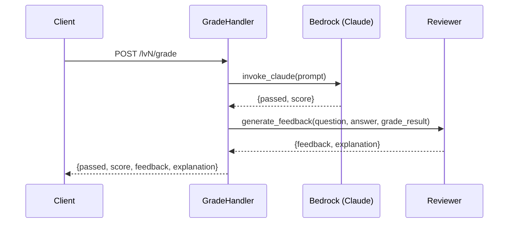
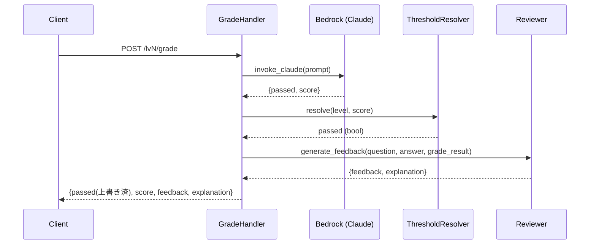

# 設計書: configurable-pass-threshold

## 概要

本機能は、AIカリキュラムシステムの各レベル（LV1〜LV4）における合否判定を、環境変数で設定可能な閾値に基づいてオーバーライドする仕組みを導入する。

現状、各Grade Handlerは`invoke_claude()`の返却値に含まれる`passed`フィールドをそのままレスポンスに使用している。本設計では、新規モジュール`Threshold_Resolver`を追加し、AIが返す`score`値と環境変数で定義された閾値を比較して`passed`を再判定する。

変更の影響範囲は以下に限定される:
- `serverless.yml`: 環境変数4つの追加
- `backend/lib/threshold_resolver.py`: 新規モジュール（閾値の読み取り・バリデーション・判定）
- `backend/handlers/grade_handler.py`, `lv2_grade_handler.py`, `lv3_grade_handler.py`, `lv4_grade_handler.py`: 閾値判定の呼び出し追加（各ファイル2〜3行の変更）

## アーキテクチャ

### 現在のフロー



### 変更後のフロー



### 設計判断

- **単一モジュール方式を採用**: 各ハンドラに閾値ロジックを埋め込むのではなく、`threshold_resolver.py`に集約する。これにより、バリデーションロジックの重複を防ぎ、要件4.5（共通バリデーションロジック）を満たす。
- **関数ベースAPI**: クラスではなく純粋関数として実装する。状態を持たず、テストが容易になる。
- **環境変数の読み取りタイミング**: 関数呼び出し時に毎回`os.environ`から読み取る。Lambda実行環境ではコールドスタート時に環境変数がセットされるため、キャッシュの必要はない。

## コンポーネントとインターフェース

### ThresholdResolver モジュール (`backend/lib/threshold_resolver.py`)

```python
def get_threshold(level: int) -> int:
    """指定レベルの合格閾値を環境変数から取得する。
    
    Args:
        level: レベル番号 (1-4)
    
    Returns:
        合格閾値 (0-100の整数)
    
    バリデーション:
        - 環境変数が未設定 → デフォルト値30
        - 整数変換不可 → デフォルト値30 + 警告ログ
        - 0未満 → 0に補正 + 警告ログ
        - 100超 → 100に補正 + 警告ログ
    """

def resolve_passed(level: int, score: int) -> bool:
    """スコアが閾値以上かどうかを判定する。
    
    Args:
        level: レベル番号 (1-4)
        score: AIが返したスコア (0-100)
    
    Returns:
        True if score >= threshold, False otherwise
    """
```

### Grade Handler への統合パターン

各ハンドラでの変更は最小限:

```python
# 変更前
grade_result = _parse_grade_result(grade_raw)

# 変更後
from backend.lib.threshold_resolver import resolve_passed

grade_result = _parse_grade_result(grade_raw)
grade_result["passed"] = resolve_passed(level=1, score=grade_result["score"])  # levelは各ハンドラで固定
```

### serverless.yml 環境変数

```yaml
provider:
  environment:
    # 既存
    RESULTS_TABLE: ai-levels-results
    PROGRESS_TABLE: ai-levels-progress
    BEDROCK_MODEL_ID: global.anthropic.claude-sonnet-4-6
    # 新規追加
    PASS_THRESHOLD_LV1: "30"
    PASS_THRESHOLD_LV2: "30"
    PASS_THRESHOLD_LV3: "30"
    PASS_THRESHOLD_LV4: "30"
```

## データモデル

本機能はデータベーススキーマの変更を伴わない。影響するデータ構造は以下の通り:

### 環境変数マッピング

| 環境変数名 | 対象レベル | 型 | デフォルト値 | 有効範囲 |
|---|---|---|---|---|
| `PASS_THRESHOLD_LV1` | LV1 | 文字列→整数 | 30 | 0〜100 |
| `PASS_THRESHOLD_LV2` | LV2 | 文字列→整数 | 30 | 0〜100 |
| `PASS_THRESHOLD_LV3` | LV3 | 文字列→整数 | 30 | 0〜100 |
| `PASS_THRESHOLD_LV4` | LV4 | 文字列→整数 | 30 | 0〜100 |

### Grade Result 構造（変更なし）

```python
grade_result = {
    "passed": bool,  # 閾値ベースで上書きされる
    "score": int,    # AIが返した値をそのまま保持 (0-100)
}
```

レスポンスボディの構造も変更なし。`passed`フィールドの値の決定ロジックのみが変わる。

## 正当性プロパティ

*プロパティとは、システムの全ての有効な実行において成り立つべき特性や振る舞いのことである。人間が読める仕様と機械的に検証可能な正当性保証の橋渡しとなる形式的な記述である。*

### Property 1: 閾値判定の正当性

*任意の*レベル(1-4)、*任意の*スコア(0-100)、*任意の*閾値(0-100)に対して、`resolve_passed(level, score)`の結果は`score >= threshold`と等しくなること。AIが返した元の`passed`値に関わらず、閾値ベースの判定が適用される。

**Validates: Requirements 2.1, 2.2, 2.3**

### Property 2: スコア保持

*任意の*AIスコア(0-100)と*任意の*閾値設定に対して、Grade Handlerのレスポンスに含まれる`score`値はAIが返した値と一致すること。閾値オーバーライドはスコア値を変更しない。

**Validates: Requirements 2.4**

### Property 3: 閾値バリデーション結果の範囲保証

*任意の*環境変数値（整数、非整数文字列、負数、100超の値、空文字列、未設定を含む）に対して、`get_threshold(level)`の返却値は常に0以上100以下の整数であること。

**Validates: Requirements 3.1, 3.2, 3.3**

### Property 4: 不正値検出時の警告ログ

*任意の*不正な環境変数値（非整数文字列、0未満、100超）に対して、`get_threshold(level)`は警告ログを出力すること。有効な値(0-100の整数)に対しては警告ログを出力しないこと。

**Validates: Requirements 3.4**

### Property 5: レベル別環境変数の正しい参照

*任意の*レベル(1-4)に対して、`get_threshold(level)`は`PASS_THRESHOLD_LV{level}`環境変数の値を参照すること。異なるレベルの環境変数を参照しないこと。

**Validates: Requirements 4.1, 4.2, 4.3, 4.4**

## エラーハンドリング

### 環境変数の不正値

| ケース | 動作 | ログレベル |
|---|---|---|
| 環境変数未設定 | デフォルト値30を使用 | なし（正常動作） |
| 非整数文字列（例: "abc"） | デフォルト値30を使用 | WARNING |
| 0未満の値（例: "-10"） | 0に補正 | WARNING |
| 100超の値（例: "150"） | 100に補正 | WARNING |
| 空文字列 | デフォルト値30を使用 | WARNING |

### Grade Handler のエラーフロー

既存のエラーハンドリングに変更なし。`resolve_passed`は純粋な比較関数であり、例外を発生させない。`get_threshold`も例外を発生させず、常に有効な整数を返す。

## テスト戦略

### テストライブラリ

- プロパティベーステスト: `hypothesis`（既存プロジェクトで使用中）
- ユニットテスト: `pytest`（既存プロジェクトで使用中）

### プロパティベーステスト

各プロパティテストは最低100回のイテレーションで実行する。各テストにはコメントで設計書のプロパティを参照する。

| テスト | 対応プロパティ | タグ |
|---|---|---|
| `test_threshold_judgment_correctness` | Property 1 | Feature: configurable-pass-threshold, Property 1: 閾値判定の正当性 |
| `test_score_preserved` | Property 2 | Feature: configurable-pass-threshold, Property 2: スコア保持 |
| `test_threshold_validation_range` | Property 3 | Feature: configurable-pass-threshold, Property 3: 閾値バリデーション結果の範囲保証 |
| `test_invalid_value_warning_log` | Property 4 | Feature: configurable-pass-threshold, Property 4: 不正値検出時の警告ログ |
| `test_level_env_var_mapping` | Property 5 | Feature: configurable-pass-threshold, Property 5: レベル別環境変数の正しい参照 |

### ユニットテスト

プロパティテストを補完する具体的なケース:

- `test_default_threshold_when_env_not_set`: 環境変数未設定時にデフォルト30が返ること（要件1.3）
- `test_serverless_yml_has_threshold_env_vars`: serverless.ymlに4つの環境変数が定義されていること（要件1.1, 1.2）
- `test_each_handler_uses_correct_level`: 各ハンドラが正しいレベル番号でresolve_passedを呼び出すこと（要件4.1-4.4）

### テストファイル構成

- `tests/property/test_threshold_properties.py`: プロパティベーステスト（Property 1〜5）
- `tests/unit/test_threshold_resolver.py`: ユニットテスト
