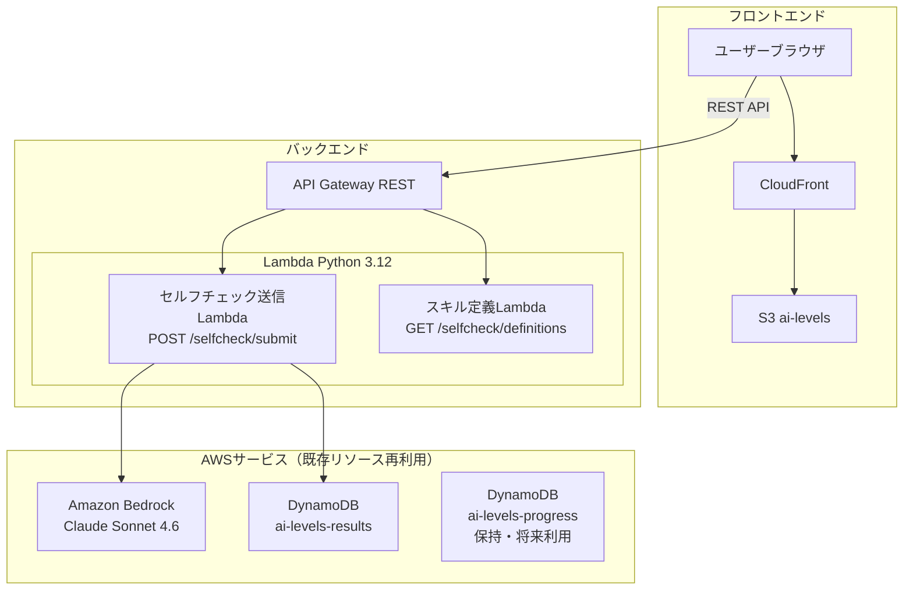
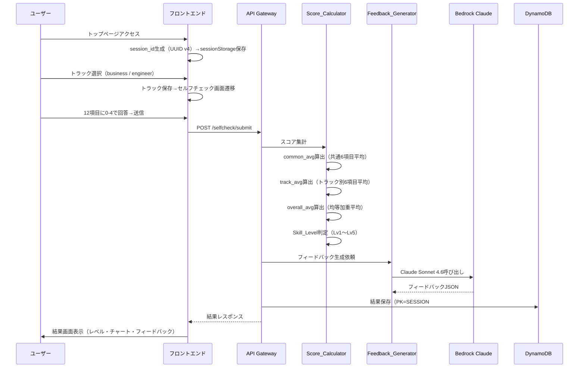
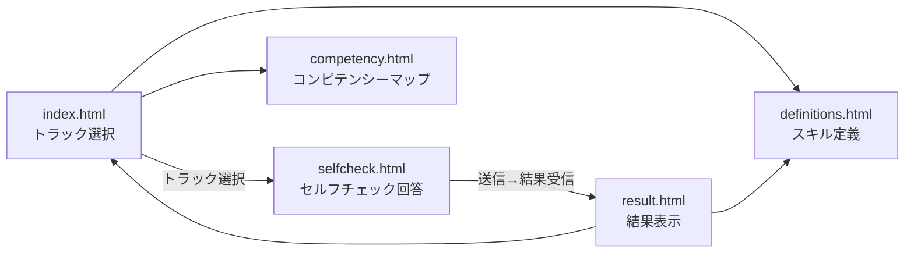

# デザインドキュメント: AIスキルセルフチェックシステム

## 概要

双日テックイノベーション向けに、既存の「AI Levels - AIカリキュラム実行システム」を全面リプレイスし、AIスキルセルフチェック＋スキル定義参照システムに置き換える。

既存のLv1〜Lv4カリキュラム（出題・採点・レビューの3エージェント構成）を廃止し、以下の3層構造に再構築する:

- **Layer 1**: 既存コンピテンシー本体（変更なし・参照のみ表示）
- **Layer 2**: AIセルフチェック（全社員共通6項目 + トラック別追加6項目、0-4スケール自己申告）
- **Layer 3**: AIスキル定義（ビジネスユーザー版 Lv1-5 / エンジニア版 Lv1-5）

既存AWSインフラ（Lambda + API Gateway + DynamoDB + Bedrock + S3/CloudFront）を活用し、バックエンドハンドラ・フロントエンドを全面書き替え。`backend/lib/bedrock_client.py`（リトライ付きBedrock共通クライアント）はそのまま流用する。

### 既存システムとの主な差分

| 項目 | 既存（AI Levels） | 新規（セルフチェック） |
|------|-------------------|----------------------|
| 評価方式 | AI出題→回答→AI採点 | 自己申告（0-4スケール） |
| エージェント | 出題・採点・レビューの3体 | フィードバック生成の1体 |
| エンドポイント | /lv1〜lv4/{generate,grade,complete} + /levels/status | /selfcheck/submit + /selfcheck/definitions |
| DynamoDB | results + progress 2テーブル | 両テーブルとも保持（resultsに新データ保存、progressは将来利用可能） |
| フロントエンド | lv1〜lv4.html + index.html | index.html + selfcheck.html + result.html + definitions.html + competency.html |
| Bedrockモデル | jp.anthropic.claude-sonnet-4-6 | 同一（フィードバック生成に使用） |

## アーキテクチャ

### システム構成図



### セルフチェック実行フロー



## コンポーネントとインターフェース

### APIエンドポイント

| メソッド | パス | 説明 | Lambda |
|---------|------|------|--------|
| POST | /selfcheck/submit | セルフチェック回答送信→スコア集計→レベル判定→フィードバック生成→結果保存→レスポンス | selfcheck_handler |
| GET | /selfcheck/definitions | スキル定義データ返却（静的データ） | definitions_handler |

### セルフチェック送信ハンドラ

```python
# backend/handlers/selfcheck_handler.py
def handler(event, context):
    """
    POST /selfcheck/submit
    リクエスト: {
        "session_id": str,       # UUID v4
        "track": str,            # "business" | "engineer"
        "answers": {             # 各項目IDをキー、0-4の整数を値
            "common_1": 3,
            "common_2": 2,
            ...
            "biz_1": 4,          # business トラックの場合
            ...
        }
    }
    レスポンス: {
        "session_id": str,
        "track": str,
        "common_avg": float,
        "track_avg": float,
        "overall_avg": float,
        "skill_level": str,      # "Lv1" 〜 "Lv5"
        "feedback": {            # null if generation failed
            "strengths": str,
            "improvements": str,
            "next_actions": str
        } | null,
        "feedback_unavailable": bool  # true if feedback generation failed
    }
    """
```

処理フロー:
1. リクエストバリデーション（session_id形式、track値、answersの項目数・値範囲）
2. Score_Calculatorでスコア集計・レベル判定
3. Feedback_GeneratorでAIフィードバック生成（失敗時はスコアのみ返却）
4. Result_StoreでDynamoDB保存
5. レスポンス返却

### スキル定義ハンドラ

```python
# backend/handlers/definitions_handler.py
def handler(event, context):
    """
    GET /selfcheck/definitions
    レスポンス: {
        "business": {
            "Lv1": {"name": "安全利用の基本者", "description": "..."},
            "Lv2": {"name": "効率化実践者", "description": "..."},
            ...
        },
        "engineer": {
            "Lv1": {"name": "エントリー", "description": "..."},
            ...
        }
    }
    """
```

### スコア集計モジュール

```python
# backend/lib/score_calculator.py

COMMON_ITEMS = ["common_1", "common_2", "common_3", "common_4", "common_5", "common_6"]
BUSINESS_ITEMS = ["biz_1", "biz_2", "biz_3", "biz_4", "biz_5", "biz_6"]
ENGINEER_ITEMS = ["eng_1", "eng_2", "eng_3", "eng_4", "eng_5", "eng_6"]

LEVEL_THRESHOLDS = [
    (0.0, 1.0, "Lv1"),
    (1.0, 2.0, "Lv2"),
    (2.0, 3.0, "Lv3"),
    (3.0, 3.5, "Lv4"),
    (3.5, 4.0, "Lv5"),
]

def validate_answers(track: str, answers: dict) -> str | None:
    """回答データのバリデーション。エラーメッセージまたはNoneを返す。"""

def calculate_scores(track: str, answers: dict) -> dict:
    """
    スコア集計・レベル判定。
    戻り値: {
        "common_avg": float,
        "track_avg": float,
        "overall_avg": float,
        "skill_level": str
    }
    """

def determine_level(overall_avg: float) -> str:
    """overall_avgからSkill_Levelを判定する。"""
```

レベル判定ロジック:
- `0.0 <= overall_avg < 1.0` → Lv1
- `1.0 <= overall_avg < 2.0` → Lv2
- `2.0 <= overall_avg < 3.0` → Lv3
- `3.0 <= overall_avg < 3.5` → Lv4
- `3.5 <= overall_avg <= 4.0` → Lv5

### フィードバック生成モジュール

```python
# backend/lib/feedback_generator.py
from backend.lib.bedrock_client import invoke_claude, strip_code_fence

FEEDBACK_SYSTEM_PROMPT = """あなたはAIスキルアドバイザーです。
セルフチェック結果に基づき、以下の3セクションでフィードバックを生成してください。

1. strengths: 強み（現在のスキルで評価できる点）
2. improvements: 改善ポイント（スコアが低い領域の具体的な改善提案）
3. next_actions: 具体的な次のアクション（1〜3個の実行可能なステップ）

出力は必ず以下のJSON形式で返してください:
{"strengths": "...", "improvements": "...", "next_actions": "..."}
"""

def generate_feedback(track: str, answers: dict, scores: dict) -> dict | None:
    """
    Bedrock Claudeでフィードバックを生成する。
    bedrock_client.invoke_claude()を使用（リトライ付き）。
    失敗時はNoneを返す。
    """
```

### セルフチェック項目定義

```python
# backend/lib/check_items.py

COMMON_ITEMS = [
    {"id": "common_1", "text": "生成AIの基本的な仕組みと限界を理解している"},
    {"id": "common_2", "text": "生成AIを業務で安全に利用するためのルールを理解している"},
    {"id": "common_3", "text": "プロンプトを工夫して目的に合った出力を得られる"},
    {"id": "common_4", "text": "生成AIの出力を批判的に評価し、正確性を検証できる"},
    {"id": "common_5", "text": "生成AIを使って業務の効率化を実践している"},
    {"id": "common_6", "text": "生成AIの活用事例を他者に説明・共有できる"},
]

BUSINESS_ITEMS = [
    {"id": "biz_1", "text": "AIを活用した情報収集・要約で業務判断を効率化している"},
    {"id": "biz_2", "text": "AIを活用して提案資料・報告書の品質を向上させている"},
    {"id": "biz_3", "text": "AIを活用してプロジェクト計画・タスク分解を行っている"},
    {"id": "biz_4", "text": "AIを活用した業務改善の提案・実行ができる"},
    {"id": "biz_5", "text": "AIを活用してコミュニケーション品質を向上させている"},
    {"id": "biz_6", "text": "AI活用のベストプラクティスをチームに展開している"},
]

ENGINEER_ITEMS = [
    {"id": "eng_1", "text": "AIコーディング支援ツールを日常的に活用している"},
    {"id": "eng_2", "text": "AIを活用したコードレビュー・テスト生成を実践している"},
    {"id": "eng_3", "text": "AIを活用したアーキテクチャ設計・技術選定を行っている"},
    {"id": "eng_4", "text": "AI/MLモデルの評価・選定・統合ができる"},
    {"id": "eng_5", "text": "AIを活用した開発プロセスの標準化・自動化を推進している"},
    {"id": "eng_6", "text": "AI技術の社内導入・技術支援をリードしている"},
]
```

### スキル定義データ

```python
# backend/lib/skill_definitions.py

BUSINESS_LEVELS = {
    "Lv1": {"name": "安全利用の基本者", "description": "生成AIの基本を理解し、安全に利用できる"},
    "Lv2": {"name": "効率化実践者", "description": "生成AIを業務効率化に活用できる"},
    "Lv3": {"name": "能力増幅実践者", "description": "生成AIで自身の能力を増幅し成果を出せる"},
    "Lv4": {"name": "他者貢献・再利用化", "description": "AI活用ノウハウを他者に展開し再利用可能にできる"},
    "Lv5": {"name": "変革リーダー", "description": "AIを活用した業務変革をリードできる"},
}

ENGINEER_LEVELS = {
    "Lv1": {"name": "エントリー", "description": "AI支援ツールの基本操作ができる"},
    "Lv2": {"name": "基礎の自走", "description": "AIを活用した開発を自走できる"},
    "Lv3": {"name": "自立実装", "description": "AIを活用した設計・実装を自立して行える"},
    "Lv4": {"name": "社内リード", "description": "AI技術の社内導入をリードできる"},
    "Lv5": {"name": "社内ハイエンド", "description": "AI技術の最先端を社内に展開できる"},
}
```

### フロントエンド構成

ロゴ: 双日テックイノベーション公式SVGロゴを使用
`https://www.sojitz-ti.com/resources/images/common/logo_stechi.svg`

```
frontend/
├── index.html          # トップページ（トラック選択）
├── selfcheck.html      # セルフチェック画面（12項目回答）
├── result.html         # 結果画面（レベル・チャート・フィードバック）
├── definitions.html    # スキル定義画面（Lv1-5参照）
├── competency.html     # コンピテンシーマップ画面
├── favicon.ico
├── css/
│   └── style.css       # 全面書き替え（#4a7c9b系カラーパレット、Noto Sans JP）
└── js/
    ├── config.js        # API Base URL（既存流用）
    ├── api.js           # API通信層（全面書き替え）
    └── selfcheck-app.js # セルフチェックアプリロジック（新規）
```

### ページ遷移フロー



### serverless.yml変更

既存のLv1〜Lv4関連Lambda関数を全て削除し、セルフチェック用の2関数に置き換える。
**既存AWSリソース（DynamoDB両テーブル、S3バケット、CloudFront、API Gateway等）は全てそのまま再利用する。新規リソースは作成しない。**

```yaml
service: ai-levels-backend  # 既存サービス名を維持

provider:
  name: aws
  runtime: python3.12
  region: ap-northeast-1
  environment:
    RESULTS_TABLE: ai-levels-results       # 既存テーブル再利用
    PROGRESS_TABLE: ai-levels-progress     # 既存テーブル保持（将来利用可能）
    BEDROCK_MODEL_ID: jp.anthropic.claude-sonnet-4-6
  timeout: 60
  iam:
    role:
      statements:
        - Effect: Allow
          Action:
            - dynamodb:PutItem
            - dynamodb:GetItem
            - dynamodb:Query
          Resource:
            - !GetAtt ResultsTable.Arn
            - !GetAtt ProgressTable.Arn   # 既存テーブルのIAM権限も維持
        - Effect: Allow
          Action:
            - bedrock:InvokeModel
          Resource: "*"

functions:
  selfcheckSubmit:
    handler: backend/handlers/selfcheck_handler.handler
    events:
      - http:
          path: selfcheck/submit
          method: post
          cors: true
  selfcheckDefinitions:
    handler: backend/handlers/definitions_handler.handler
    events:
      - http:
          path: selfcheck/definitions
          method: get
          cors: true

resources:
  Resources:
    # 既存リソースを全てそのまま保持（上書きデプロイで再利用）
    GatewayResponseDefault4XX:
      Type: AWS::ApiGateway::GatewayResponse
      Properties:
        ResponseParameters:
          gatewayresponse.header.Access-Control-Allow-Origin: "'*'"
          gatewayresponse.header.Access-Control-Allow-Headers: "'Content-Type'"
          gatewayresponse.header.Access-Control-Allow-Methods: "'GET,POST,OPTIONS'"
        ResponseType: DEFAULT_4XX
        RestApiId:
          Ref: ApiGatewayRestApi
    GatewayResponseDefault5XX:
      Type: AWS::ApiGateway::GatewayResponse
      Properties:
        ResponseParameters:
          gatewayresponse.header.Access-Control-Allow-Origin: "'*'"
          gatewayresponse.header.Access-Control-Allow-Headers: "'Content-Type'"
          gatewayresponse.header.Access-Control-Allow-Methods: "'GET,POST,OPTIONS'"
        ResponseType: DEFAULT_5XX
        RestApiId:
          Ref: ApiGatewayRestApi
    ResultsTable:
      Type: AWS::DynamoDB::Table
      Properties:
        TableName: ai-levels-results
        BillingMode: PAY_PER_REQUEST
        AttributeDefinitions:
          - AttributeName: PK
            AttributeType: S
          - AttributeName: SK
            AttributeType: S
        KeySchema:
          - AttributeName: PK
            KeyType: HASH
          - AttributeName: SK
            KeyType: RANGE
    ProgressTable:
      Type: AWS::DynamoDB::Table
      Properties:
        TableName: ai-levels-progress
        BillingMode: PAY_PER_REQUEST
        AttributeDefinitions:
          - AttributeName: PK
            AttributeType: S
          - AttributeName: SK
            AttributeType: S
        KeySchema:
          - AttributeName: PK
            KeyType: HASH
          - AttributeName: SK
            KeyType: RANGE
```

**リソース再利用方針:**
- DynamoDB `ai-levels-results`: 既存テーブルをそのまま使用。新しいセルフチェック結果は `SK=RESULT#selfcheck` で保存（既存のLv1-4データと共存可能）
- DynamoDB `ai-levels-progress`: テーブル定義を残す（削除するとCloudFormationスタック更新時にエラーになるため）。将来的に再利用可能
- S3 `ai-levels`: 既存バケットにフロントエンドを上書きデプロイ
- CloudFront: 既存ディストリビューションをそのまま使用
- API Gateway: 既存REST APIを上書き（旧エンドポイントは自動削除、新エンドポイントが追加）

## データモデル

### DynamoDB: ai-levels-results（セルフチェック結果）

| 属性 | 型 | 説明 |
|------|-----|------|
| PK | String | `SESSION#{session_id}` |
| SK | String | `RESULT#selfcheck` |
| session_id | String | セッション識別子（UUID v4） |
| track | String | `"business"` or `"engineer"` |
| answers | Map | 各項目IDをキー、0-4の整数を値 |
| common_avg | Number | 共通6項目の平均スコア |
| track_avg | Number | トラック別6項目の平均スコア |
| overall_avg | Number | 総合平均スコア |
| skill_level | String | `"Lv1"` 〜 `"Lv5"` |
| feedback | Map / Null | `{strengths, improvements, next_actions}` or null |
| user_id | String / Null | 将来的なユーザー紐付け用（オプショナル） |
| completed_at | String | 完了タイムスタンプ（ISO 8601） |

### セッションデータ（フロントエンド sessionStorage）

```json
{
  "session_id": "uuid-v4",
  "track": "business" | "engineer",
  "started_at": "ISO 8601"
}
```

キー名: `selfcheck_session`


## 正当性プロパティ

*プロパティとは、システムの全ての有効な実行において成り立つべき特性や振る舞いのことである。人間が読める仕様と機械的に検証可能な正当性保証の橋渡しとなる形式的な記述である。*

### Property 1: スコア集計の数学的正当性

*任意の*有効な回答データ（共通6項目 + トラック別6項目、各0-4の整数）に対して、Score_Calculatorが算出するcommon_avgは共通6項目の算術平均と一致し、track_avgはトラック別6項目の算術平均と一致し、overall_avgは`(common_avg + track_avg) / 2`と一致すること。

**Validates: Requirements 3.3, 11.1, 11.2, 11.3**

### Property 2: レベル判定の正当性

*任意の*overall_avg値（0.0〜4.0の範囲）に対して、determine_level()が返すSkill_Levelは以下の閾値マッピングと一致すること: 0.0≤x<1.0→Lv1, 1.0≤x<2.0→Lv2, 2.0≤x<3.0→Lv3, 3.0≤x<3.5→Lv4, 3.5≤x≤4.0→Lv5。

**Validates: Requirements 3.4, 11.4**

### Property 3: トラック別項目選択の正当性

*任意の*トラック（"business" または "engineer"）に対して、必要な回答項目は共通6項目 + 該当トラック固有6項目の合計12項目であり、異なるトラックの項目が混在しないこと。

**Validates: Requirements 2.2, 2.3**

### Property 4: スコアバリデーションの正当性

*任意の*回答データに対して、いずれかの項目のスコアが0〜4の整数でない場合（範囲外、非整数、欠損）、validate_answers()はエラーメッセージを返却し、Score_Calculatorは処理を拒否すること。

**Validates: Requirements 3.2, 11.5, 11.6**

### Property 5: session_idバリデーションの正当性

*任意の*文字列に対して、UUID v4形式に合致しない場合、API_HandlerはHTTPステータス400とエラーメッセージを返却すること。

**Validates: Requirements 9.3, 10.5**

### Property 6: フィードバック構造の正当性

*任意の*正常なフィードバック生成結果に対して、返却されるJSONはstrengths（空でない文字列）、improvements（空でない文字列）、next_actions（空でない文字列）の3フィールドを全て含むこと。

**Validates: Requirements 4.2, 4.3**

### Property 7: DynamoDB保存レコードの完全性

*任意の*有効なセルフチェック送信に対して、DynamoDBに保存されるレコードは、PK=`SESSION#{session_id}`、SK=`RESULT#selfcheck`の形式であり、session_id、track、answers、common_avg、track_avg、overall_avg、skill_level、feedback（またはnull）、user_id（またはnull）、completed_atの全フィールドを含むこと。

**Validates: Requirements 6.1, 6.2, 6.4**

### Property 8: APIレスポンス構造の正当性

*任意の*有効なセルフチェック送信に対して、POST /selfcheck/submit のレスポンスはsession_id、track、common_avg（number）、track_avg（number）、overall_avg（number）、skill_level（string）、feedback（object | null）の全フィールドを含むこと。

**Validates: Requirements 10.3**

### Property 9: CORSヘッダーの付与

*任意の*APIレスポンス（成功・エラー問わず）に対して、`Access-Control-Allow-Origin: *`ヘッダーが含まれること。

**Validates: Requirements 10.6**

## エラーハンドリング

### Bedrock Runtime呼び出しエラー

既存の`bedrock_client.py`の指数バックオフリトライ機構をそのまま利用する。

| エラー種別 | 対応 |
|-----------|------|
| ThrottlingException | 指数バックオフで最大3回リトライ（bedrock_client.py内蔵） |
| ServiceUnavailableException | 同上 |
| ModelTimeoutException | 同上 |
| リトライ上限超過 | フィードバック未生成としてスコア・レベルのみ返却、`feedback_unavailable: true` |

### DynamoDB書き込みエラー

| エラー種別 | 対応 |
|-----------|------|
| ClientError（全般） | エラーログ出力、HTTPステータス500 + リトライ可能なエラーメッセージ返却 |

### APIリクエストバリデーション

| バリデーション項目 | エラー時の応答 |
|-------------------|--------------|
| session_idがUUID v4でない | 400 + `"session_id must be a valid UUID v4"` |
| trackが"business"/"engineer"以外 | 400 + `"track must be 'business' or 'engineer'"` |
| answersの項目数が12でない | 400 + `"answers must contain exactly 12 items"` |
| answersの値が0-4の整数でない | 400 + `"each answer must be an integer between 0 and 4"` |
| answersの項目IDがトラックと不一致 | 400 + `"answer keys do not match the selected track"` |
| リクエストボディが不正なJSON | 400 + `"Invalid JSON in request body"` |

### フロントエンドエラーハンドリング

- API呼び出し失敗時: エラーメッセージ + リトライボタン表示
- ネットワークエラー時: 接続確認メッセージ表示
- フィードバック未生成時: スコア・レベルのみ表示 + 「フィードバックは現在取得できません」メッセージ

## テスト戦略

### テストフレームワーク

- **バックエンド**: pytest + pytest-mock（ユニットテスト）、hypothesis（プロパティベーステスト）
- **フロントエンド**: 手動テスト

### プロパティベーステスト

プロパティベーステストライブラリとして**hypothesis**（Python）を使用する。

各プロパティテストは最低100回のイテレーションで実行する。各テストにはデザインドキュメントのプロパティ番号を参照するコメントタグを付与する。

タグ形式: **Feature: sojitz-ai-skill-check, Property {number}: {property_text}**

各正当性プロパティは1つのプロパティベーステストで実装する。

### ユニットテスト

ユニットテストはプロパティベーステストを補完し、以下に焦点を当てる:
- 具体的な入出力例の検証（正常系・異常系）
- エッジケース（全項目0、全項目4、境界値スコア）
- Bedrock呼び出し失敗時のフォールバック動作（フィードバック未生成）
- DynamoDB保存失敗時のエラーハンドリング
- Bedrock呼び出しのモック検証（正しいリージョン・モデルID）
- スキル定義APIの静的データ返却検証
- レベル判定の境界値テスト（0.0, 1.0, 2.0, 3.0, 3.5, 4.0）

### テスト構成

```
tests/
├── unit/
│   ├── test_selfcheck_handler.py       # セルフチェック送信ハンドラ
│   ├── test_definitions_handler.py     # スキル定義ハンドラ
│   ├── test_score_calculator.py        # スコア集計・レベル判定
│   ├── test_feedback_generator.py      # フィードバック生成
│   └── test_bedrock_client.py          # 既存（変更なし）
└── property/
    ├── test_score_properties.py        # Property 1, 2, 4
    ├── test_track_properties.py        # Property 3
    ├── test_selfcheck_api_properties.py # Property 5, 8, 9
    ├── test_feedback_properties.py     # Property 6
    └── test_dynamo_properties.py       # Property 7
```
