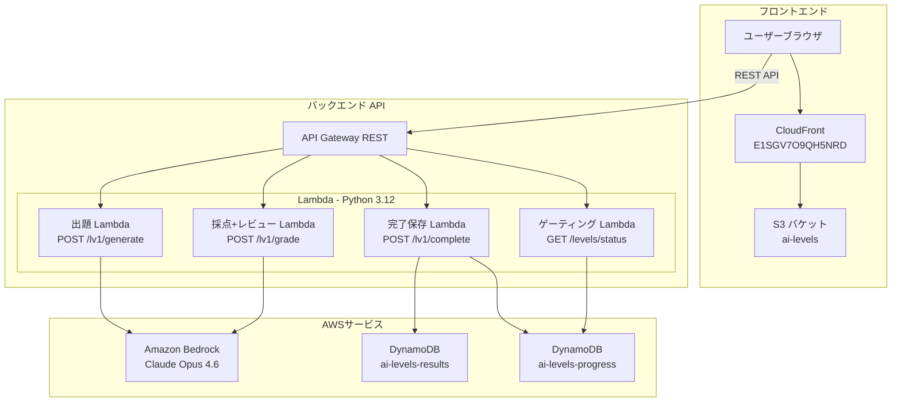
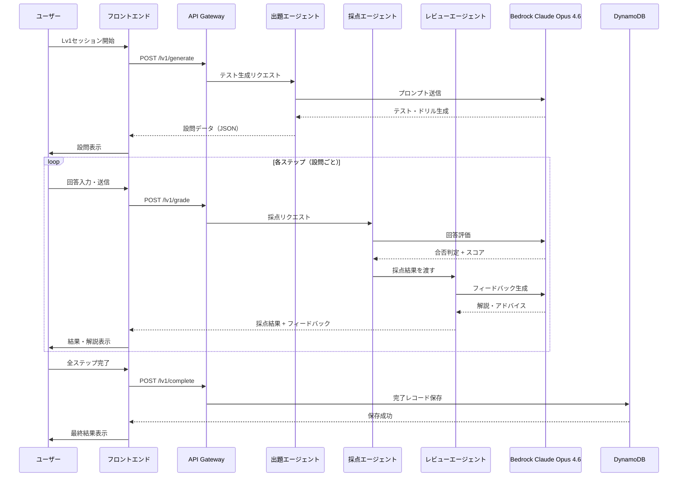
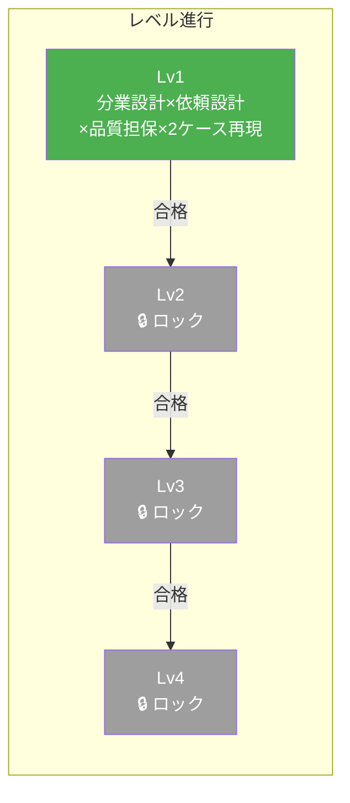

# AI Levels - AIカリキュラム実行システム

3つのAIエージェント（出題・採点・レビュー）が連動し、カリキュラム「分業設計×依頼設計×品質担保×2ケース再現」をブラウザ上でログインなしに実行できるシステム。

## システムアーキテクチャ



## 3エージェント連動パイプライン



## ゲーティング構造




Lv1に合格するとLv2がアンロックされる段階的進行方式。MVP段階ではLv1のみ実装済み、Lv2〜Lv4は将来拡張用のスロットとして存在。

## 技術スタック

| レイヤー | 技術 |
|---------|------|
| フロントエンド | バニラ HTML/CSS/JS（フレームワーク不使用） |
| 配信 | CloudFront + S3 |
| API | API Gateway（REST） |
| コンピュート | AWS Lambda（Python 3.12） |
| AI モデル | Amazon Bedrock - Claude Opus 4.6（`global.anthropic.claude-opus-4-6-v1`） |
| データベース | DynamoDB（`ai-levels-results`, `ai-levels-progress`） |
| IaC | Serverless Framework v3 |
| CI/CD | GitHub Actions |

## プロジェクト構成

```
├── backend/
│   ├── handlers/
│   │   ├── generate_handler.py   # 出題エージェント
│   │   ├── grade_handler.py      # 採点+レビューエージェント
│   │   ├── complete_handler.py   # 完了レコード保存
│   │   └── gate_handler.py       # ゲーティング判定
│   └── lib/
│       ├── bedrock_client.py     # Bedrock呼び出し共通モジュール
│       └── reviewer.py           # レビューエージェント
├── frontend/
│   ├── index.html                # レベル選択画面
│   ├── lv1.html                  # Lv1カリキュラム実行画面
│   ├── css/style.css
│   └── js/
│       ├── app.js                # セッション管理・フロー制御
│       ├── api.js                # APIクライアント
│       └── gate.js               # ゲーティングロジック
├── tests/
│   ├── unit/                     # ユニットテスト（57件）
│   └── property/                 # プロパティベーステスト（13件）
├── serverless.yml
└── .github/workflows/deploy.yml
```

## 設計上の特徴

- **認証不要**: Lv1はログインなしでアクセス可能。セッションはブラウザの `sessionStorage` で管理
- **完了時のみDB保存**: 途中離脱ではDynamoDBへの書き込みが発生しない（ストレージコスト最適化）
- **1 APIコールで採点+レビュー**: `/lv1/grade` 内部でGrader → Reviewerを連鎖実行
- **指数バックオフリトライ**: Bedrock呼び出しのThrottlingExceptionに対して最大3回リトライ
- **プロパティベーステスト**: Hypothesisを使用した8つの正当性プロパティで形式的な品質保証

## ローカル開発

```bash
# 依存関係インストール
pip install -r requirements.txt

# テスト実行（70件）
python -m pytest tests/ -v
```

## デプロイ

`main` ブランチへのpushで GitHub Actions が自動実行:

1. バックエンド: `serverless deploy --stage prod`
2. フロントエンド: `aws s3 sync` → CloudFront キャッシュ無効化

必要なGitHub Secrets:
- `SERVERLESS_ACCESS_KEY`
- `AWS_ACCESS_KEY_ID`
- `AWS_SECRET_ACCESS_KEY`
