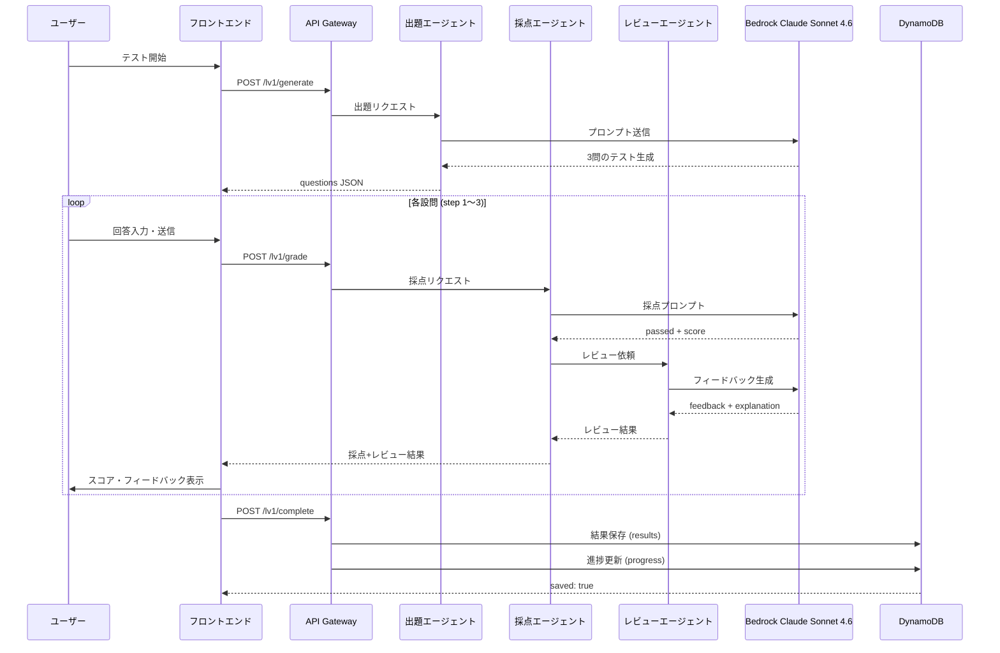
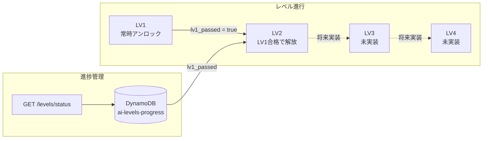
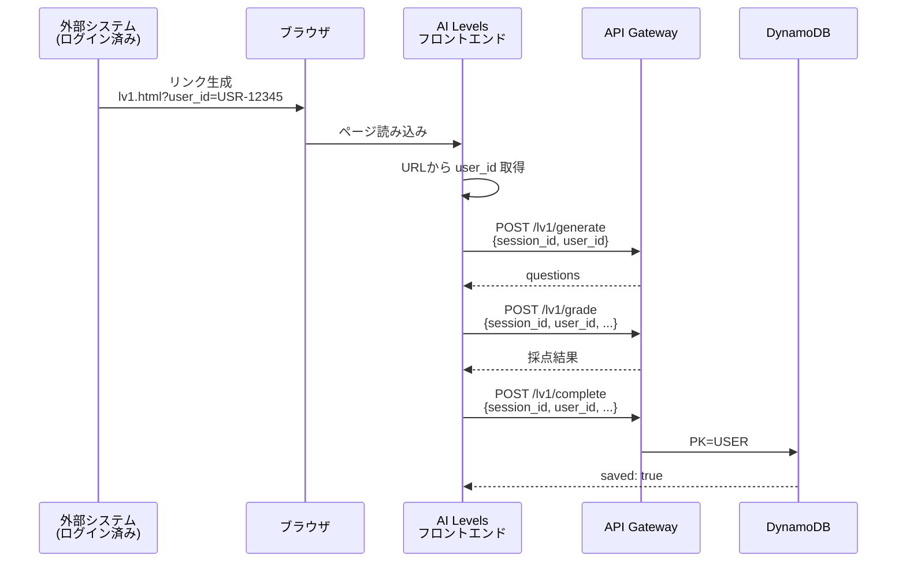

# AI Levels - AIカリキュラム実行システム

🔗 **https://d2iarskyjm3rk1.cloudfront.net/**

3つのAIエージェント（出題・採点・レビュー）が連動し、カリキュラム「分業設計×依頼設計×品質担保×2ケース再現」をブラウザ上でログインなしに実行できるシステム。

## システムアーキテクチャ


## 3エージェント連動パイプライン



## ゲーティング構造



## 技術スタック

| レイヤー | 技術 | 備考 |
|---------|------|------|
| フロントエンド | HTML / CSS / Vanilla JS | SPA不要、静的ホスティング |
| CDN | CloudFront | S3オリジン、キャッシュ無効化対応 |
| API | API Gateway REST | CORS有効、29秒タイムアウト制限 |
| コンピュート | AWS Lambda (Python 3.12) | タイムアウト60秒 |
| AI | Amazon Bedrock Claude Sonnet 4.6 | グローバル推論プロファイル |
| DB | DynamoDB (PAY_PER_REQUEST) | results + progress 2テーブル |
| IaC | Serverless Framework | ローカルv4 / CI v3 |
| CI/CD | GitHub Actions | main push で自動デプロイ |
| テスト | pytest + Hypothesis | ユニット57件 + プロパティ13件 |

### なぜ Claude Sonnet 4.6 か

API Gatewayのハードリミットは29秒。Claude Opus 4.6では1リクエストあたり35〜44秒かかり、タイムアウトが頻発した。Claude Sonnet 4.6はMVPに十分な品質（テスト生成・採点・レビュー）を29秒以内で提供でき、コスト効率も良い。

## プロジェクト構成

```
.
├── backend/
│   ├── handlers/
│   │   ├── generate_handler.py   # 出題エージェント
│   │   ├── grade_handler.py      # 採点エージェント + レビュー呼出
│   │   ├── complete_handler.py   # 完了保存
│   │   └── gate_handler.py       # ゲーティング
│   └── lib/
│       ├── bedrock_client.py     # Bedrock共通クライアント (リトライ付き)
│       └── reviewer.py           # レビューエージェント
├── frontend/
│   ├── index.html                # トップページ
│   ├── lv1.html                  # LV1テスト画面
│   ├── favicon.ico
│   ├── css/style.css
│   └── js/
│       ├── config.js             # API Base URL設定
│       ├── api.js                # API通信層
│       ├── app.js                # LV1アプリロジック
│       └── gate.js               # ゲーティングUI
├── tests/
│   ├── unit/                     # ユニットテスト (57件)
│   └── property/                 # プロパティベーステスト (13件)
├── .github/workflows/deploy.yml  # CI/CDパイプライン
├── serverless.yml                # インフラ定義
└── requirements.txt              # Python依存
```

## 設計上の特徴

- **認証なし**: session_id (UUID v4) ベースでセッション管理。ログイン不要でブラウザから即実行可能
- **3エージェント分業**: 出題・採点・レビューを独立したプロンプト/ハンドラで分離し、責務を明確化
- **リトライ付きBedrock呼出**: ThrottlingException等に対し指数バックオフで最大3回リトライ
- **コードフェンス除去**: LLMが ` ```json ``` ` で囲んで返すケースに対応する `strip_code_fence()` を実装
- **CORS全開放**: `Access-Control-Allow-Origin: *` で全ハンドラ統一
- **DynamoDB 2テーブル設計**: results (テスト結果詳細) と progress (レベル進捗) を分離

## ローカル開発

```bash
# 依存インストール
pip install -r requirements.txt

# テスト実行
pytest tests/ -v

# デプロイ (Serverless Framework v4)
serverless deploy --stage prod
```

## デプロイ

`main` ブランチへの push で GitHub Actions が自動実行:

1. **バックエンド**: `serverless deploy --stage prod` (Serverless Framework v3)
2. **フロントエンド**: `aws s3 sync frontend/ s3://ai-levels --delete` → CloudFrontキャッシュ無効化

必要な GitHub Secrets:
- `AWS_ACCESS_KEY_ID`
- `AWS_SECRET_ACCESS_KEY`
- `SERVERLESS_ACCESS_KEY`
## 提案: 外部ログインシステムとのユーザー紐付け

### 背景

現在のシステムは `session_id` (UUID v4) で匿名セッション管理しているが、既存の外部システムにログイン機能とユーザー識別子が実装済みであれば、クエリパラメーター付きリンクを踏んでもらうだけでユーザー単位の回答保存が実現できる。

### 仕組み

```
外部システム → リンク生成 → AI Levels → DynamoDB にユーザー紐付け保存
```

1. 外部システム（ログイン済み）がユーザーごとにリンクを生成:
   ```
   https://d2iarskyjm3rk1.cloudfront.net/lv1.html?user_id=USR-12345
   ```

2. フロントエンドが `user_id` をクエリパラメーターから取得し、全APIリクエストに付与

3. バックエンドが `user_id` をDynamoDBのキーに組み込み、ユーザー単位で結果を保存

### データフロー



### DynamoDB キー設計の変更

| 現在 | 変更後 |
|------|--------|
| `PK: SESSION#{session_id}` | `PK: USER#{user_id}` |
| `SK: RESULT#lv1` | `SK: RESULT#lv1#{session_id}` |

この変更により、同一ユーザーの複数回受験履歴をクエリで一括取得できる:

```python
# ユーザーの全受験履歴を取得
table.query(
    KeyConditionExpression="PK = :pk AND begins_with(SK, :sk)",
    ExpressionAttributeValues={
        ":pk": f"USER#{user_id}",
        ":sk": "RESULT#lv1"
    }
)
```

### 必要な変更箇所

| ファイル | 変更内容 |
|---------|---------|
| `frontend/js/app.js` | `URLSearchParams` で `user_id` を取得、APIリクエストに付与 |
| `frontend/js/api.js` | 各API呼び出しに `user_id` パラメーターを追加 |
| `backend/handlers/complete_handler.py` | PK を `USER#{user_id}` に変更、バリデーション追加 |
| `backend/handlers/gate_handler.py` | `user_id` ベースで進捗を取得 |

### セキュリティ上の注意

- `user_id` はクエリパラメーターで渡すだけなので、URLを知っていれば誰でもなりすまし可能
- MVP段階ではこれで十分だが、本番運用時は以下を検討:
  - 外部システムで署名付きトークン (HMAC / JWT) を生成し、AI Levels側で検証
  - トークンに有効期限を設定し、リプレイ攻撃を防止
