# AI Levels - AIカリキュラム実行システム

🔗 **https://d2iarskyjm3rk1.cloudfront.net/**

3つのAIエージェント（出題・採点・レビュー）が連動し、カリキュラム「分業設計×依頼設計×品質担保×2ケース再現」をブラウザ上でログインなしに実行できるシステム。

## システムアーキテクチャ

```mermaid
graph TB
    subgraph "フロントエンド"
        Browser[ユーザーブラウザ]
        CF[CloudFront<br/>E1SGV7O9QH5NRD]
        S3[S3 バケット<br/>ai-levels]
    end

    subgraph "バックエンド API"
        APIGW[API Gateway REST]
        subgraph "Lambda - Python 3.12"
            Gen[出題 Lambda<br/>POST /lv1/generate]
            Grade[採点+レビュー Lambda<br/>POST /lv1/grade]
            Complete[完了保存 Lambda<br/>POST /lv1/complete]
            Gate[ゲーティング Lambda<br/>GET /levels/status]
        end
    end

    subgraph "AWSサービス"
        Bedrock[Amazon Bedrock<br/>Claude Sonnet 4.6]
        DDB_R[DynamoDB<br/>ai-levels-results]
        DDB_P[DynamoDB<br/>ai-levels-progress]
    end

    Browser --> CF --> S3
    Browser -->|REST API| APIGW
    APIGW --> Gen
    APIGW --> Grade
    APIGW --> Complete
    APIGW --> Gate
    Gen --> Bedrock
    Grade --> Bedrock
    Complete --> DDB_R
    Complete --> DDB_P
    Gate --> DDB_P
```



## 3エージェント連動パイプライン

```mermaid
sequenceDiagram
    participant U as ユーザー
    participant FE as フロントエンド
    participant API as API Gateway
    participant TG as 出題エージェント
    participant G as 採点エージェント
    participant R as レビューエージェント
    participant BR as Bedrock Claude Sonnet 4.6
    participant DB as DynamoDB

    U->>FE: テスト開始
    FE->>API: POST /lv1/generate
    API->>TG: 出題リクエスト
    TG->>BR: プロンプト送信
    BR-->>TG: 3問のテスト生成
    TG-->>FE: questions JSON

    loop 各設問 (step 1〜3)
        U->>FE: 回答入力・送信
        FE->>API: POST /lv1/grade
        API->>G: 採点リクエスト
        G->>BR: 採点プロンプト
        BR-->>G: passed + score
        G->>R: レビュー依頼
        R->>BR: フィードバック生成
        BR-->>R: feedback + explanation
        R-->>G: レビュー結果
        G-->>FE: 採点+レビュー結果
        FE->>U: スコア・フィードバック表示
    end

    FE->>API: POST /lv1/complete
    API->>DB: 結果保存 (results)
    API->>DB: 進捗更新 (progress)
    DB-->>FE: saved: true
```



## ゲーティング構造

```mermaid
graph LR
    subgraph "レベル進行"
        LV1[LV1<br/>常時アンロック]
        LV2[LV2<br/>LV1合格で解放]
        LV3[LV3<br/>未実装]
        LV4[LV4<br/>未実装]
    end

    LV1 -->|lv1_passed = true| LV2
    LV2 -.->|将来実装| LV3
    LV3 -.->|将来実装| LV4

    subgraph "進捗管理"
        GATE[GET /levels/status]
        PROG[(DynamoDB<br/>ai-levels-progress)]
    end

    GATE --> PROG
    PROG -->|lv1_passed| LV2
```



## 技術スタック

| レイヤー | 技術 | 備考 |
|---------|------|------|
| フロントエンド | HTML / CSS / Vanilla JS | SPA不要、静的ホスティング |
| CDN | CloudFront | S3オリジン、キャッシュ無効化対応 |
| API | API Gateway REST | CORS有効、29秒タイムアウト制限 |
| コンピュート | AWS Lambda (Python 3.12) | タイムアウト60秒 |
| AI | Amazon Bedrock Claude Sonnet 4.6 | グローバル推論プロファイル |
| DB | DynamoDB (PAY_PER_REQUEST) | results + progress 2テーブル |
| IaC | Serverless Framework | ローカルv4 / CI v3 |
| CI/CD | GitHub Actions | main push で自動デプロイ |
| テスト | pytest + Hypothesis | ユニット57件 + プロパティ13件 |

### なぜ Claude Sonnet 4.6 か

API Gatewayのハードリミットは29秒。Claude Opus 4.6では1リクエストあたり35〜44秒かかり、タイムアウトが頻発した。Claude Sonnet 4.6はMVPに十分な品質（テスト生成・採点・レビュー）を29秒以内で提供でき、コスト効率も良い。

## プロジェクト構成

```
.
├── backend/
│   ├── handlers/
│   │   ├── generate_handler.py   # 出題エージェント
│   │   ├── grade_handler.py      # 採点エージェント + レビュー呼出
│   │   ├── complete_handler.py   # 完了保存
│   │   └── gate_handler.py       # ゲーティング
│   └── lib/
│       ├── bedrock_client.py     # Bedrock共通クライアント (リトライ付き)
│       └── reviewer.py           # レビューエージェント
├── frontend/
│   ├── index.html                # トップページ
│   ├── lv1.html                  # LV1テスト画面
│   ├── favicon.ico
│   ├── css/style.css
│   └── js/
│       ├── config.js             # API Base URL設定
│       ├── api.js                # API通信層
│       ├── app.js                # LV1アプリロジック
│       └── gate.js               # ゲーティングUI
├── tests/
│   ├── unit/                     # ユニットテスト (57件)
│   └── property/                 # プロパティベーステスト (13件)
├── .github/workflows/deploy.yml  # CI/CDパイプライン
├── serverless.yml                # インフラ定義
└── requirements.txt              # Python依存
```

## 設計上の特徴

- **認証なし**: session_id (UUID v4) ベースでセッション管理。ログイン不要でブラウザから即実行可能
- **3エージェント分業**: 出題・採点・レビューを独立したプロンプト/ハンドラで分離し、責務を明確化
- **リトライ付きBedrock呼出**: ThrottlingException等に対し指数バックオフで最大3回リトライ
- **コードフェンス除去**: LLMが ` ```json ``` ` で囲んで返すケースに対応する `strip_code_fence()` を実装
- **CORS全開放**: `Access-Control-Allow-Origin: *` で全ハンドラ統一
- **DynamoDB 2テーブル設計**: results (テスト結果詳細) と progress (レベル進捗) を分離

## ローカル開発

```bash
# 依存インストール
pip install -r requirements.txt

# テスト実行
pytest tests/ -v

# デプロイ (Serverless Framework v4)
serverless deploy --stage prod
```

## デプロイ

`main` ブランチへの push で GitHub Actions が自動実行:

1. **バックエンド**: `serverless deploy --stage prod` (Serverless Framework v3)
2. **フロントエンド**: `aws s3 sync frontend/ s3://ai-levels --delete` → CloudFrontキャッシュ無効化

必要な GitHub Secrets:
- `AWS_ACCESS_KEY_ID`
- `AWS_SECRET_ACCESS_KEY`
- `SERVERLESS_ACCESS_KEY`
